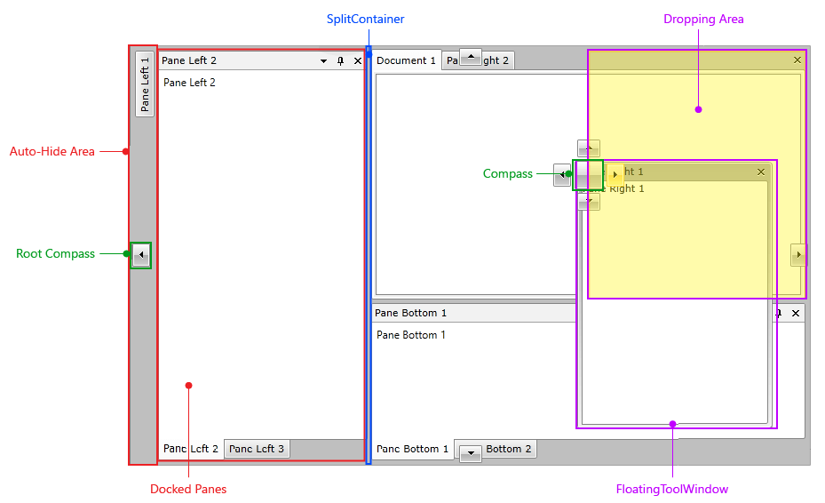

# Visual Structure

This section defines the terms and the concepts used in the scope of __RadDocking__ which you have to get familiar with prior to continue reading this help.
      

## Main Areas

__RadDocking__ has three main areas:
        

* __Document host__

* __Dockable area__

* __Auto hide area__

## Layout Elements

To create a fully featured layout you need the following controls: 

* __RadDocking__ – the main container, that holds all the layout, drag and re-arrange logic. It is host for all the other controls.
            

* __RadSplitContainer__ – this control can be hosted directly in the __RadDocking__control, in a window in the [DocumentHost]() area or in a [ToolWindow](). It is designed to hold a series of pane groups or other split containers and arrange them one after another supporting proportional space, dividing between its items by showing splitters between them. [Read more]()

* __RadPaneGroup__ – this control has a list of __Panes__ and a header with commands for the currently selected pane and displaying its header. [Read more]()

* __RadPane__ – the content unit of the __RadDocking__ control. It has a variety of properties that allow you to customize its behavior. [Read more]()

* __Auto-Hide Area__ - this is the area where the tabs of the [unpinned](#Unpinned_Panes) documents are placed. An unpinned pane is shown when your mouse hovers over its tab.
            

* __Split Container__- this is [RadSplitContainer]() that can be hosted directly in the __RadDocking__control, in a window in the [DocumentHost]() area or in a [ToolWindow](). It is designed to hold series of pane groups or other split containers and arrange them one after another supporting proportional space, dividing between its items by showing splitters between them.
            

* __Root Compass -__  this is the menu that marks the possible docking positions in the root docking container. It has four indicators: Left, Top, Right and Bottom, where each one of them points to the respective docking position within the root container.____[Read more](#Root_Compass)

* __Compass Menu__ - this is the menu that marks the possible docking positions within a container. The Compass menu is always shown in the middle of the container you are dragging your panes over. It has five indicators: Left, Top, Right, Bottom and Center, where each one of them points to the respective docking position within this container. [Read more](#Compass)

* __Dropping Area__ - area that highlights where the document will be docked if it's dropped.
            

* __Floating ToolWindow__ - window that is part of __RadDocking__, but is not docked. [Read more]()

* __Grouped/Tabbed Panes__ - panes grouped in a [RadPaneGroup]() control.
            

* __Docked Panes__ - the [docked panes](#Docking_Panes) are all those panes that are hosted inside the __RadDocking__ control and are not floatable.
            

# See Also

 * [Key Features]()

 * [Getting Started]()

 * [Templating the RadDocking]()
