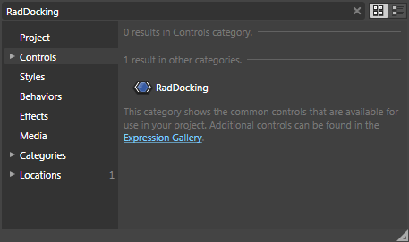
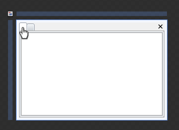
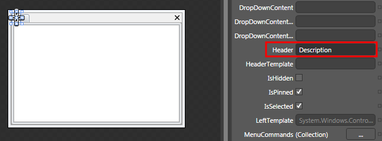
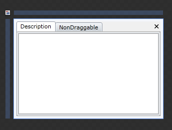
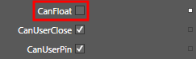
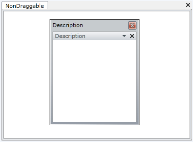
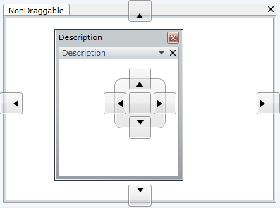

# Getting Started

__RadDocking__ is an advanced SilverlightWPF control providing full Blend support. From within the visual environment of Blend, you can easily perform various tasks such as editing control properties, modifying themes, creating and modifying templates and more.

This tutorial will walk you through the creation of a __RadDocking__ and will show how to:

* Add __RadDocking__ in a control using Expression Blend. 

* Add panes and setting their properties (__Header__, __CanUserClose__, __CanFloat__, etc.). 

>Before reading this tutorial you should get familiar with the [Visual Structure]() of the standard __RadDocking__ control and its elements.

For the purpose of this tutorial, you will need to create an empty SilverlightWPF Application project and open it in Blend.

>

In order to use __RadDocking__ control in your projects you have to add references to ____

* Telerik.Windows.Controls.dll

* Telerik.Windows.Controls.Navigation.dll

* Telerik.Windows.Controls.Docking.dll

* Telerik.Windows.Controls.dll

* Telerik.Windows.Controls.Navigation.dll

* Telerik.Windows.Controls.Docking.dll

* Telerik.Windows.Data.dll

## Adding RadDocking

Open the __Asset__ Library (Window->Assets) in Expression Blend and start writing the name of the __RadDocking__ in the search box. 

         
      

Drag a __RadDocking__ control on the art board. 

         
      

As a result you can see the __RadDocking__. The underlaying XAML is pretty simple and looks like this:

#### __XAML__

{{region raddocking-getting-started2_0}}
	<telerik:RadDocking/>
	{{endregion}}

## Adding DocumentHost

The [Document Host]() is ment to be the default container for the editable documents in your application. By default it occupies the whole central area of the __RadDocking__control and each newly added pane is docked as a new tab page inside it. Switch to the XAML view (*View -> Active Document View -> XAML View*) and add a __DocumentHost__ to the __RadDocking__. In order to do that you need to set the __RadDocking.DocumentHost__ property.

#### __XAML__

{{region raddocking-getting-started2_1}}
	<telerik:RadDocking>
	    <telerik:RadDocking.DocumentHost>
	    </telerik:RadDocking.DocumentHost>
	</telerik:RadDocking>
	{{endregion}}

## Adding RadSplitContainer

The [RadSplitContainer]() allows you to use movable bars to divide the displayed area into resizable parts. With the __RadDocking__'s __SplitContainers__ you can build complex layouts. Some practical examples of such layouts are Explorer-like and Outlook-like interfaces.

Below you can see how to add a __RadSplitContainer__ inside the __DocumentHost__. For more information about the __RadSplitContainer.__

#### __XAML__

{{region raddocking-getting-started2_2}}
	<telerik:RadDocking>
	    <telerik:RadDocking.DocumentHost>
	        <telerik:RadSplitContainer>
	        </telerik:RadSplitContainer>
	    </telerik:RadDocking.DocumentHost>
	</telerik:RadDocking>
	{{endregion}}

## Adding RadPaneGroup

Before adding panes to your __RadDocking__ declaration you need to add [RadPaneGroup]() first. __RadPane__ cannot exist separately, it always has to be placed inside of a __RadPaneGroup__. The reason for this requirement is the fact that __RadPaneGroup__ directly inherits __RadTabControl__, while the __RadPane__ derives from __RadTabItem__.

#### __XAML__

{{region raddocking-getting-started2_3}}
	<telerik:RadDocking>
	    <telerik:RadDocking.DocumentHost>
	        <telerik:RadSplitContainer>
	            <telerik:RadPaneGroup>
	            </telerik:RadPaneGroup>
	        </telerik:RadSplitContainer>
	    </telerik:RadDocking.DocumentHost>
	</telerik:RadDocking>
	{{endregion}}

## Adding RadPanes

[RadPane]() is the main content unit of the __RadDocking__ control. Its main purpose is to act as a host of your content. That's why in order to have functional __RadDocking__ you need to have at least one __RadPane__ placed inside it.

#### __XAML__

{{region raddocking-getting-started2_4}}
	<telerik:RadDocking>
	    <telerik:RadDocking.DocumentHost>
	        <telerik:RadSplitContainer>
	            <telerik:RadPaneGroup>
	                <telerik:RadPane>
	                </telerik:RadPane>
	                <telerik:RadPane>
	                </telerik:RadPane>
	            </telerik:RadPaneGroup>
	        </telerik:RadSplitContainer>
	    </telerik:RadDocking.DocumentHost>
	</telerik:RadDocking>
	{{endregion}}

So far your dock should look like the snapshot below:

         
      

## Setting the Header Property

Select the first tabbed pane.

         
      

Set its [Header](#Header) property to "Description".

         
      

Repeat the same procedure for the second tabbed pane - set its __Header__ property to "NotDraggable__"__.

Here is the result so far:

         
      

The XAML is pretty simple and can be seen on the next figure:

#### __XAML__

{{region raddocking-getting-started2_5}}
	<telerik:RadDocking>
	    <telerik:RadDocking.DocumentHost>
	        <telerik:RadSplitContainer>
	            <telerik:RadPaneGroup>
	                <telerik:RadPane Header="Description">
	                </telerik:RadPane>
	                <telerik:RadPane Header="NonDraggable">
	                </telerik:RadPane>
	            </telerik:RadPaneGroup>
	        </telerik:RadSplitContainer>
	    </telerik:RadDocking.DocumentHost>
	</telerik:RadDocking>
	{{endregion}}

>tip__The DocumentHost control is not a required element.__Make an experiment, remove it from the XAML above and run your application to see how the application changes.

## Setting CanFloat Property

As you suggest the second pane (with __Header__ "NonDraggable") cannot be [dragged and dropped](). In order to do that you need to set the [CanFloat]() property.

Select the second tabbed pane and set the __CanFloat__ property to __false__.

         
      

#### __XAML__

{{region raddocking-getting-started2_6}}
	<telerik:RadDocking>
	    <telerik:RadDocking.DocumentHost>
	        <telerik:RadSplitContainer>
	            <telerik:RadPaneGroup>
	                <telerik:RadPane Header="Description">
	                </telerik:RadPane>
	                <telerik:RadPane Header="NonDraggable" CanFloat="False">
	                </telerik:RadPane>
	            </telerik:RadPaneGroup>
	        </telerik:RadSplitContainer>
	    </telerik:RadDocking.DocumentHost>
	</telerik:RadDocking>
	{{endregion}}

Run your demo and try to [drag and drop]() the "Description" pane. You will end up with a floatable window. Now try to drag and drop the "NonDraggable" window.

         
      

Note the [visual indicators]() which appear while you are dragging the "Description" pane - these visual indicators are called the [Compass]() menu.

         
      

The __RadDocking__ gives you the ability to style them in the way you want. For more information read [here]().

## Adding Some Content

Go back to the design surface in Expression Blend. Switch to the XAML view (View -> Active Document View -> XAML View). Add some content to each one of the panes. For example:

#### __XAML__

{{region raddocking-getting-started2_7}}
	<telerik:RadDocking Width="300" Height="200">
	    <telerik:RadDocking.DocumentHost>
	        <telerik:RadSplitContainer>
	            <telerik:RadPaneGroup>
	                <telerik:RadPane Header="Description">
	                    <TextBlock TextWrapping="Wrap" Text="On the Documents tab above press Ctrl + Mouse Left button to display the Popup Menu. You can use the same combination on every tab."/>
	                </telerik:RadPane>
	                <telerik:RadPane Header="NonDraggable" CanFloat="False">
	                    <TextBlock TextWrapping="Wrap" Text="This pane cannot be dragged, because it has its property CanFloat set 'False'."/>
	                </telerik:RadPane>
	            </telerik:RadPaneGroup>
	        </telerik:RadSplitContainer>
	    </telerik:RadDocking.DocumentHost>
	</telerik:RadDocking>
	{{endregion}}

         
      

## Adding Pinned Panes

The next step is to add panes which are initially [pinned]() to any of the sides in the docking area. Switch again to the XAML view (View -> Active Document View -> XAML View).

Add several panes and set their __Header__ like it is in the XAML below.

#### __XAML__

{{region raddocking-getting-started2_8}}
	<telerik:RadDocking Width="300" Height="200">
	    <telerik:RadDocking.DocumentHost>
	        <telerik:RadSplitContainer>
	            <telerik:RadPaneGroup>
	                <telerik:RadPane Header="Description">
	                    <TextBlock TextWrapping="Wrap" Text="On the Documents tab above press Ctrl + Mouse Left button to display the Popup Menu. You can use the same combination on every tab."/>
	                </telerik:RadPane>
	                <telerik:RadPane Header="NonDraggable" CanFloat="False">
	                    <TextBlock TextWrapping="Wrap" Text="This pane cannot be dragged, because it has its property CanFloat set 'False'."/>
	                </telerik:RadPane>
	            </telerik:RadPaneGroup>
	        </telerik:RadSplitContainer>
	    </telerik:RadDocking.DocumentHost>
	
	    <telerik:RadSplitContainer InitialPosition="DockedLeft">
	        <telerik:RadPaneGroup>
	            <telerik:RadPane Header="Toolbox"/>
	            <telerik:RadPane Header="Server Explorer"/>
	        </telerik:RadPaneGroup>
	    </telerik:RadSplitContainer>
	
	    <telerik:RadSplitContainer InitialPosition="DockedRight">
	        <telerik:RadPaneGroup>
	            <telerik:RadPane Header="Properties"/>
	            <telerik:RadPane Header="Solution Explorer"/>
	        </telerik:RadPaneGroup>
	    </telerik:RadSplitContainer>
	
	    <telerik:RadSplitContainer InitialPosition="DockedBottom">
	        <telerik:RadPaneGroup>
	            <telerik:RadPane Header="Output"/>
	            <telerik:RadPane Header="Error List"/>
	        </telerik:RadPaneGroup>
	    </telerik:RadSplitContainer>
	
	</telerik:RadDocking>
	{{endregion}}

>

Two things must be mentioned in the above code snippet:

1. Note that the three [RadSplitContainers]() you added are not hosted in __DocumentHost__. The result will be that these splitters can be initially docked to any side of the dock area. 

1. Note the __InitialPosition__property. It indicates where the splitter to be initially docked.

Here is how the final result should look like:

         
      

If you need further customizations of the RadDocking you can take a look at some of the following topics:

* [Style the RadPane]()

* [Style the RadPane Header]()

* [Style the Compass]()

* [Style the RootCompass]()

* [Style the Visual Cue]()

* [Style the RadPaneGroup]()

* [Style the RadDocumentPane]()

* [Style the ToolWindow]()

* [Style the RadSplitContainer]()

* [Freeze]() the layout. 

* Add icon to the __RadPane__'s [Header](). 

* [Add or Remove]() menu items to the RadPane's menu.

You can also save the [layout]() and the [content of the pane]().

If you need to dive deeper in the __RadDocking__ structure, consider any of the following topics:

* What are the [RadPane]() and the [RadDocumentPane]()? 

* [Docked](), [Pinned](), [Floating](), [Unpinned]() and [Grouped]() panes. 

* What is [Compass]()? 

* What is [Tool Window]()? 

* What is [Split Container]()?
