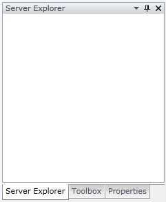
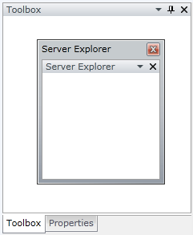
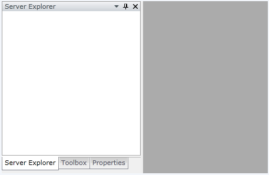
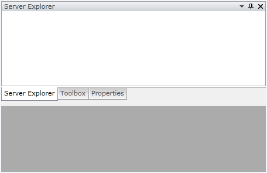
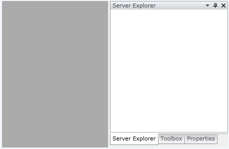
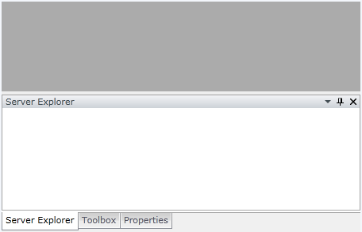

# Managing Docking Controls Dynamically

The purpose of this tutorial is to show you how to manage the __RadDocking__ control dynamically (using procedural code or XAML).

The following operation will be examined:

* [Making a pane floatable in the code-behind](#Making_a_Pane_Floatable_in_the_Code-Behind)

* [Making a pane floatable in XAML](#Making_a_Pane_Floatable_in_XAML)

* [Making a pane dockable in the code-behind](#Making_a_Pane_Dockable_in_the_Code-Behind)

* [Making a pane dockable in XAML](#Making_a_Pane_Dockable_in_XAML)

* [Docking a pane in the code-behind](#Docking_a_Pane_in_the_Code-Behind)

* [Docking a pane design-time](#Docking_a_Pane_Design-Time)

* [Pin\Unpin a pane in the code-behind](#Pin/Unpin_a_Pane_in_the_Code-Behind)

* [Pin\Unpin a pane in XAML](#Pin/Unpin_a_Pane_in_XAML)

* [Closing a pane in the code-behind](#Closing_a_Pane_in_the_Code-Behind)

>Before reading this tutorial you should get familiar with the [Visual Structure]() of the standard __RadDocking__ control and its elements.

For the purpose of this tutorial, you will need to create an empty SilverlightWPF Application project.

>In order to use the __RadDocking__ control in your projects you have to add a reference to __Telerik.Windows.Controls.Docking.dll__ and __Telerik.Windows.Controls.Navigation__.

For the purpose of this tutorial the following __RadDocking__ declaration will be used:

#### __XAML__

{{region raddocking-managing-docking-controls-dynamically_0}}
	<telerik:RadDocking x:Name="radDocking">
	    <telerik:RadSplitContainer x:Name="radSplitContainer">
	        <telerik:RadPaneGroup x:Name="radGroup">
	            <telerik:RadPane x:Name="radPane1" Header="Server Explorer"/>
	            <telerik:RadPane x:Name="radPane2" Header="Toolbox"/>
	            <telerik:RadPane x:Name="radPane3" Header="Properties"/>
	        </telerik:RadPaneGroup>
	    </telerik:RadSplitContainer>
	</telerik:RadDocking>
	{{endregion}}

         
      

## Making a Pane Floatable in the Code-Behind

You can programmatically make a pane floatable by either calling __MakeFloatingDockable()__ or __MakeFloatingOnly()__ of the [RadPane]() class. Both of these methods are doing one and the same thing - they will undock your pane and host it in a separate ToolWindow.

* Using the __MakeFloatingDockable()__ method 

#### __C#__

{{region raddocking-managing-docking-controls-dynamically_1}}
	private void MakeFloatingDockable()
	{
	    radPane1.MakeFloatingDockable();
	}
	{{endregion}}

#### __VB.NET__

{{region raddocking-managing-docking-controls-dynamically_2}}
	Private Sub MakeFloatingDockable()
	    radPane1.MakeFloatingDockable()
	End Sub
	{{endregion}}

* Using the __MakeFloatingOnly()__ method 

#### __C#__

{{region raddocking-managing-docking-controls-dynamically_3}}
	private void MakeFloatingOnly()
	{
	    radPane1.MakeFloatingOnly();
	}
	{{endregion}}

#### __VB.NET__

{{region raddocking-managing-docking-controls-dynamically_4}}
	Private Sub MakeFloatingOnly()
	    radPane1.MakeFloatingOnly()
	End Sub
	{{endregion}}

>tipNote that if you make your pane floating using the __MakeFloatingOnly()__ you will not be able to dock it back again using [drag and drop](), to make it dockable again you have to call the method __MakeDockable()__.

Executing any of the described methods will lead to the following result:

         
      

>__MakeFloatingOnly()__, __MakeFloatingDockable()__ and __MakeDockable()__methods work only when all of the objects are constructed and added to the object tree. Which means that you should invoke them after the __Loaded__ event of the __RadDocking__ control has been fired.

## Making a Pane Floatable in XAML

In order to make a pane floatable during design-time, you need to set the __InitialPosition__ property of the respective [RadSplitContainer]() either to __FloatingDockable__ or __FloatingOnly__.

* Using the __FloatingDockable__ initial position 

#### __XAML__

{{region raddocking-managing-docking-controls-dynamically_5}}
	<telerik:RadDocking x:Name="radDocking">
	    <telerik:RadSplitContainer x:Name="radSplitContainer" InitialPosition="FloatingDockable">
	        <telerik:RadPaneGroup x:Name="radGroup">
	            <telerik:RadPane x:Name="radPane1" Header="Server Explorer"/>
	            <telerik:RadPane x:Name="radPane2" Header="Toolbox"/>
	            <telerik:RadPane x:Name="radPane3" Header="Properties"/>
	        </telerik:RadPaneGroup>
	    </telerik:RadSplitContainer>
	</telerik:RadDocking>
	{{endregion}}

* Using the __FloatingOnly__ initial position 

#### __XAML__

{{region raddocking-managing-docking-controls-dynamically_6}}
	<telerik:RadDocking x:Name="radDocking">
	   <telerik:RadSplitContainer x:Name="radSplitContainer" InitialPosition="FloatingOnly">
	        <telerik:RadPaneGroup x:Name="radGroup">
	            <telerik:RadPane x:Name="radPane1" Header="Server Explorer"/>
	            <telerik:RadPane x:Name="radPane2" Header="Toolbox"/>
	            <telerik:RadPane x:Name="radPane3" Header="Properties"/>
	        </telerik:RadPaneGroup>
	    </telerik:RadSplitContainer>
	</telerik:RadDocking>
	{{endregion}}

>Note, that when setting the __InitialPosition__ to __FloatingOnly__, you won't be able to dock the pane during run-time. In order to make the pane dockable again, you need to invoke the __MakeDockable()__ method of the __RadPane__ class.

## Making a Pane Dockable in the Code-Behind

In order to make a pane dockable, you need to invoke the __MakeDockable()__ method of an instance of the __RadPane__ class.

#### __C#__

{{region raddocking-managing-docking-controls-dynamically_7}}
	private void MakeDockable()
	{
	    radPane1.MakeDockable();
	}
	{{endregion}}

#### __VB.NET__

{{region raddocking-managing-docking-controls-dynamically_8}}
	Private Sub MakeDockable()
	    radPane1.MakeDockable()
	End Sub
	{{endregion}}

>__MakeDockable__method works only when all of the objects are constructed and added to the object tree. Which means that you should invoke it after the __Loaded__ event of the __RadDocking__ control has been fired.

>tipMaking a pane dockable __will not dock__ the pane to any of the sides in the docking area. But it will allow the user to dock the pane during run-time via [drag and drop]().

## Making a Pane Dockable in XAML

In order to make a pane dockable during design-time, you need to set the __InitialPosition__ property of the respective [RadSplitContainer]() to __FloatingDockable__, like it is shown in the code below.

#### __XAML__

{{region raddocking-managing-docking-controls-dynamically_9}}
	<telerik:RadDocking x:Name="radDocking">
	   <telerik:RadSplitContainer x:Name="radSplitContainer" InitialPosition="FloatingDockable">
	        <telerik:RadPaneGroup x:Name="radGroup">
	            <telerik:RadPane x:Name="radPane1" Header="Server Explorer"/>
	            <telerik:RadPane x:Name="radPane2" Header="Toolbox"/>
	            <telerik:RadPane x:Name="radPane3" Header="Properties"/>
	        </telerik:RadPaneGroup>
	    </telerik:RadSplitContainer>
	</telerik:RadDocking>
	{{endregion}}

>tipSetting the __InitialPosition__ to __FloatingDockable__ or __FloatingOnly__ will make your pane(s) [floating](). However, using the __FloatingOnly__ value __will not allow__ the user to dock the pane during run-time.

## Docking a Pane in the Code-Behind

In order to dock a pane in the code-behind, you need to use the __AddItem__ method of the [RadGroupPane]() class.

#### __C#__

{{region raddocking-managing-docking-controls-dynamically_10}}
	public void AddItem( RadPane item, DockPosition dockPosition );
	{{endregion}}

#### __VB.NET__

{{region raddocking-managing-docking-controls-dynamically_11}}
	Public Sub AddItem(ByVal item As RadPane, ByVal dockPosition As DockPosition)
	End Sub
	{{endregion}}

## Docking a Pane Design-Time

In order to dock a pane during design-time, you need to set the __InitialPosition__ property of the respective [RadSplitContainer]() to any of the following values:

* __DockedLeft__

#### __XAML__

{{region raddocking-managing-docking-controls-dynamically_12}}
	<telerik:RadDocking x:Name="radDocking">
	    <telerik:RadSplitContainer x:Name="radSplitContainer" InitialPosition="DockedLeft">
	        <telerik:RadPaneGroup x:Name="radGroup">
	            <telerik:RadPane x:Name="radPane1" Header="Server Explorer"/>
	            <telerik:RadPane x:Name="radPane2" Header="Toolbox"/>
	            <telerik:RadPane x:Name="radPane3" Header="Properties"/>
	        </telerik:RadPaneGroup>
	    </telerik:RadSplitContainer>
	</telerik:RadDocking>
	{{endregion}}

         
      

* __DockedTop__

#### __XAML__

{{region raddocking-managing-docking-controls-dynamically_13}}
	<telerik:RadDocking x:Name="radDocking">
	   <telerik:RadSplitContainer x:Name="radSplitContainer" InitialPosition="DockedTop">
	        <telerik:RadPaneGroup x:Name="radGroup">
	            <telerik:RadPane x:Name="radPane1" Header="Server Explorer"/>
	            <telerik:RadPane x:Name="radPane2" Header="Toolbox"/>
	            <telerik:RadPane x:Name="radPane3" Header="Properties"/>
	        </telerik:RadPaneGroup>
	    </telerik:RadSplitContainer>
	</telerik:RadDocking>
	{{endregion}}

         
      

* __DockedRight__

#### __XAML__

{{region raddocking-managing-docking-controls-dynamically_14}}
	<telerik:RadDocking x:Name="radDocking">
	    <telerik:RadSplitContainer x:Name="radSplitContainer" InitialPosition="DockedRight">
	        <telerik:RadPaneGroup x:Name="radGroup">
	            <telerik:RadPane x:Name="radPane1" Header="Server Explorer"/>
	            <telerik:RadPane x:Name="radPane2" Header="Toolbox"/>
	            <telerik:RadPane x:Name="radPane3" Header="Properties"/>
	        </telerik:RadPaneGroup>
	    </telerik:RadSplitContainer>
	</telerik:RadDocking>
	{{endregion}}

         
      

* __DockedBottom__

#### __XAML__

{{region raddocking-managing-docking-controls-dynamically_15}}
	<telerik:RadDocking x:Name="radDocking">
	    <telerik:RadSplitContainer x:Name="radSplitContainer" InitialPosition="DockedBottom">
	        <telerik:RadPaneGroup x:Name="radGroup">
	            <telerik:RadPane x:Name="radPane1" Header="Server Explorer"/>
	            <telerik:RadPane x:Name="radPane2" Header="Toolbox"/>
	            <telerik:RadPane x:Name="radPane3" Header="Properties"/>
	        </telerik:RadPaneGroup>
	    </telerik:RadSplitContainer>
	</telerik:RadDocking>
	{{endregion}}

         
      

## Pin/Unpin a Pane in the Code-Behind

In order to __pin__ a pane in the code-behind, you need to set the __IsPinned__ property of the __RadPane__ class to __True__.

#### __C#__

{{region raddocking-managing-docking-controls-dynamically_16}}
	private void PinPane()
	{
	    radPane1.IsPinned = true;
	}
	{{endregion}}

#### __VB.NET__

{{region raddocking-managing-docking-controls-dynamically_17}}
	Private Sub PinPane()
	    radPane1.IsPinned = True
	End Sub
	{{endregion}}

Respectively, in order to __unpin__ a pane in the code-behind, you need to set the __IsPinned__ property of the __RadPane__ class to __False__.

#### __C#__

{{region raddocking-managing-docking-controls-dynamically_18}}
	private void UnpinPane()
	{
	    radPane1.IsPinned = false;
	}
	{{endregion}}

#### __VB.NET__

{{region raddocking-managing-docking-controls-dynamically_19}}
	Private Sub UnpinPane()
	    radPane1.IsPinned = False
	End Sub
	{{endregion}}

>

If you intend to use the __IsPinned__ property in the code-behind, make sure you are setting its value after the __Loaded__ event has been fired. Otherwise it won't work.

## Pin/Unpin a Pane in XAML

In order to __pin__ a pane in XAML, you need to set the __IsPinned__ attribute of the RadPane to __True__.

Respectively, in order to __unpin__ a pane in XAML, you need to set the __IsPinned__ attribute of the RadPane to __False__.

#### __XAML__

{{region raddocking-managing-docking-controls-dynamically_20}}
	<telerik:RadDocking x:Name="radDocking">
	    <telerik:RadSplitContainer x:Name="radSplitContainer">
	        <telerik:RadPaneGroup x:Name="radGroup">
	            <telerik:RadPane x:Name="radPane1" Header="Server Explorer" IsPinned="False"/>     
	            <telerik:RadPane x:Name="radPane2" Header="Toolbox"/>
	            <telerik:RadPane x:Name="radPane3" Header="Properties"/>
	        </telerik:RadPaneGroup>
	    </telerik:RadSplitContainer>
	</telerik:RadDocking>
	{{endregion}}

## Closing a Pane in the Code-Behind

If you want to close a pane in the code-behind, then you need to set the __IsHidden__ property of the __RadPane__ class to __False__.

#### __C#__

{{region raddocking-managing-docking-controls-dynamically_21}}
	private void ClosePane()
	{
	    radPane1.IsHidden = false;
	}
	{{endregion}}

#### __VB.NET__

{{region raddocking-managing-docking-controls-dynamically_22}}
	Private Sub ClosePane()
	    radPane1.IsHidden = False
	End Sub
	{{endregion}}

If you need further management of the __RadDocking__ you can take a look at some of the following topics:

* [Hiding](#Hiding_All_Panes) all panes. 

* [Showing](#Showing_All_Panes) all panes. 

* [Pin](#Pinning_All_Panes) all panes. 

* [Unpin](#Unpining_All_Panes) all panes. 

* Disabling the [Close ("X")]() Button. 

* Adding menu items to the [RadPane's Menu](). 

* [Freezing]() the layout.

If you need further customizations of the __RadDocking__ you can take a look at some of the following topics:

* [Style the RadPane]()

* [Style the RadPane Header]()

* [Style the Compass]()

* [Style the RootCompass]()

* [Style the Visual Cue]()

* [Style the RadPaneGroup]()

* [Style the RadDocumentPane]()

* [Style the ToolWindow]()

* [Style the RadSplitContainer]()

# See Also

 * [Key Features]()

 * [Visual Structure]()

 * [Getting Started]()
