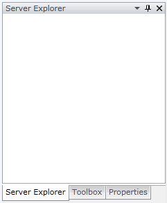
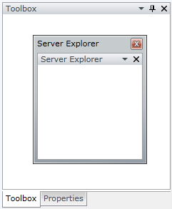
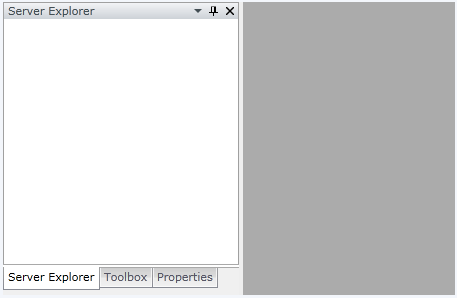
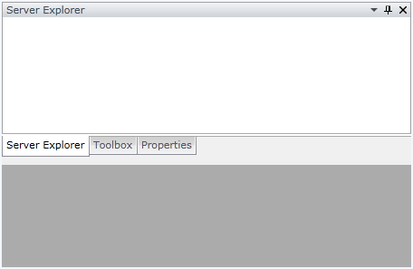
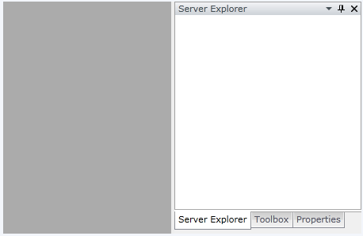
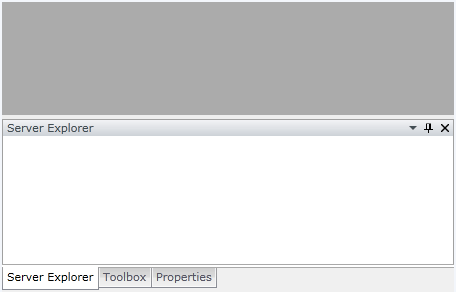

# Managing Docking Controls Dynamically

The purpose of this tutorial is to show you how to manage the __RadDocking__ control dynamically (using procedural code or XAML).

The following operation will be examined:

* [Making a pane floatable in the code-behind](#making-a-pane-floatable-in-the-code-behind)

* [Making a pane floatable in XAML](#making-a-pane-floatable-in-xaml)

* [Making a pane dockable in the code-behind](#making-a-pane-dockable-in-the-code-behind)

* [Making a pane dockable in XAML](#making-a-pane-dockable-in-xaml)

* [Docking a pane in the code-behind](#docking-a-pane-in-the-code-behind)

* [Docking a pane design-time](#docking-a-pane-design-time)

* [Pin\Unpin a pane in the code-behind](#pin-unpin-a-pane-in-the-code-behind)

* [Pin\Unpin a pane in XAML](#pin-unpin-a-pane-in-xaml)

* [Closing a pane in the code-behind](#closing-a-pane-in-the-code-behind)

>Before reading this tutorial you should get familiar with the [Visual Structure]() of the standard __RadDocking__ control and its elements.

For the purpose of this tutorial, you will need to create an empty WPF Application project.

>In order to use the __RadDocking__ control in your projects you have to add a reference to __Telerik.Windows.Controls.Docking.dll__ and __Telerik.Windows.Controls.Navigation__.

For the purpose of this tutorial the following __RadDocking__ declaration will be used:

<snippet id='raddocking-getting-started-managing-docking-dynamically-block_1-xaml' />

 

## Making a Pane Floatable in the Code-Behind

You can programmatically make a pane floatable by either calling __MakeFloatingDockable()__ or __MakeFloatingOnly()__ of the [RadPane]() class. Both of these methods are doing one and the same thing - they will undock your pane and host it in a separate ToolWindow.

* Using the __MakeFloatingDockable()__ method 

<snippet id='raddocking-getting-started-managing-docking-dynamically-block_2-cs' />

<snippet id='raddocking-getting-started-managing-docking-dynamically-block_2-vb' />

* Using the __MakeFloatingOnly()__ method 

<snippet id='raddocking-getting-started-managing-docking-dynamically-block_3-cs' />

<snippet id='raddocking-getting-started-managing-docking-dynamically-block_3-vb' />

>tip Note that if you make your pane floating using the __MakeFloatingOnly()__ you will not be able to dock it back again using [drag and drop](), to make it dockable again you have to call the method __MakeDockable()__.

Executing any of the described methods will lead to the following result:

>__MakeFloatingOnly()__, __MakeFloatingDockable()__ and __MakeDockable()__ methods work only when all of the objects are constructed and added to the object tree. Which means that you should invoke them after the __Loaded__ event of the __RadDocking__ control has been fired.

## Making a Pane Floatable in XAML

In order to make a pane floatable during design-time, you need to set the __InitialPosition__ property of the respective [RadSplitContainer]() either to __FloatingDockable__ or __FloatingOnly__.

* Using the __FloatingDockable__ initial position 

<snippet id='raddocking-getting-started-managing-docking-dynamically-block_4-xaml' />

* Using the __FloatingOnly__ initial position 

<snippet id='raddocking-getting-started-managing-docking-dynamically-block_5-xaml' />

>Note, that when setting the __InitialPosition__ to __FloatingOnly__, you won't be able to dock the pane during run-time. In order to make the pane dockable again, you need to invoke the __MakeDockable()__ method of the __RadPane__ class.

## Making a Pane Dockable in the Code-Behind

In order to make a pane dockable, you need to invoke the __MakeDockable()__ method of an instance of the __RadPane__ class.

<snippet id='raddocking-getting-started-managing-docking-dynamically-block_6-cs' />

<snippet id='raddocking-getting-started-managing-docking-dynamically-block_6-vb' />

>__MakeDockable__ method works only when all of the objects are constructed and added to the object tree. Which means that you should invoke it after the __Loaded__ event of the __RadDocking__ control has been fired.

>tip Making a pane dockable __will not dock__ the pane to any of the sides in the docking area. But it will allow the user to dock the pane during run-time via [drag and drop]().

## Making a Pane Dockable in XAML

In order to make a pane dockable during design-time, you need to set the __InitialPosition__ property of the respective [RadSplitContainer]() to __FloatingDockable__, like it is shown in the code below.

<snippet id='raddocking-getting-started-managing-docking-dynamically-block_7-xaml' />

>tip Setting the __InitialPosition__ to __FloatingDockable__ or __FloatingOnly__ will make your pane(s) [floating](). However, using the __FloatingOnly__ value __will not allow__ the user to dock the pane during run-time.

## Docking a Pane in the Code-Behind

In order to dock a pane in the code-behind, you need to use the __AddItem__ method of the [RadGroupPane]() class.

<snippet id='raddocking-getting-started-managing-docking-dynamically-block_8-cs' />

<snippet id='raddocking-getting-started-managing-docking-dynamically-block_8-vb' />

## Docking a Pane Design-Time

In order to dock a pane during design-time, you need to set the __InitialPosition__ property of the respective [RadSplitContainer]() to any of the following values:

* __DockedLeft__

<snippet id='raddocking-getting-started-managing-docking-dynamically-block_9-xaml' />

  

* __DockedTop__

<snippet id='raddocking-getting-started-managing-docking-dynamically-block_10-xaml' />

* __DockedRight__

<snippet id='raddocking-getting-started-managing-docking-dynamically-block_11-xaml' />

 

* __DockedBottom__

<snippet id='raddocking-getting-started-managing-docking-dynamically-block_12-xaml' />

## Pin/Unpin a Pane in the Code-Behind

In order to __pin__ a pane in the code-behind, you need to set the __IsPinned__ property of the __RadPane__ class to __True__.

<snippet id='raddocking-getting-started-managing-docking-dynamically-block_13-cs' />

<snippet id='raddocking-getting-started-managing-docking-dynamically-block_13-vb' />

Respectively, in order to __unpin__ a pane in the code-behind, you need to set the __IsPinned__ property of the __RadPane__ class to __False__.

<snippet id='raddocking-getting-started-managing-docking-dynamically-block_14-cs' />

<snippet id='raddocking-getting-started-managing-docking-dynamically-block_14-vb' />

>If you intend to use the __IsPinned__ property in the code-behind, make sure you are setting its value after the __Loaded__ event has been fired. Otherwise it won't work.

## Pin/Unpin a Pane in XAML

In order to __pin__ a pane in XAML, you need to set the __IsPinned__ attribute of the RadPane to __True__.

Respectively, in order to __unpin__ a pane in XAML, you need to set the __IsPinned__ attribute of the RadPane to __False__.

<snippet id='raddocking-getting-started-managing-docking-dynamically-block_15-xaml' />

## Closing a Pane in the Code-Behind

If you want to close a pane in the code-behind, then you need to set the __IsHidden__ property of the __RadPane__ class to __True__.

<snippet id='raddocking-getting-started-managing-docking-dynamically-block_16-cs' />

<snippet id='raddocking-getting-started-managing-docking-dynamically-block_16-vb' />

To re-open the closed pane set `IsHidden` back to `false`.

__Re-opening a closed pane__  

<snippet id='raddocking-getting-started-managing-docking-dynamically-re_opening_a_closed_pane-cs' />

If you need further management of the __RadDocking__ you can take a look at some of the following topics:

* Disabling the [Close ("X")]() Button. 

* Adding menu items to the [RadPane's Menu](). 

* [Freezing]() the layout.

If you need further customizations of the __RadDocking__ you can take a look at some of the following topics:

* [Style the RadPane]()

* [Style the RadPane Header]()

* [Style the Compass]()

* [Style the RootCompass]()

* [Style the Visual Cue]()

* [Style the RadPaneGroup]()

* [Style the RadDocumentPane]()

* [Style the ToolWindow]()

* [Style the RadSplitContainer]()

## See Also  
 * [Key Features]()
 * [Visual Structure]()
 * [Getting Started]()
