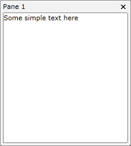
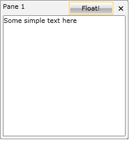

# How to Add Buttons to the Pane Header

The purpose of this tutorial is to walk you through the common task of adding buttons to the pane header and attaching some behavior to them.

>tipFor more information about the __RadPane__ and its visual elements, read [here]().

For the purpose of this tutorial, the following __RadDocking__ declaration will be used:


```XAML
	<telerik:RadDocking x:Name="radDocking">
	    <telerik:RadDocking.DocumentHost>
	        <telerik:RadSplitContainer>
	            <telerik:RadPaneGroup x:Name="radPaneGroup">
	                <telerik:RadPane Title="Pane 1">
	                    <TextBlock Text="Some simple text here"/>
	                </telerik:RadPane>
	            </telerik:RadPaneGroup>
	        </telerik:RadSplitContainer>
	    </telerik:RadDocking.DocumentHost>
	</telerik:RadDocking>
```



## Adding Buttons to the Pane Header 

In order to add additional elements to the pane header, you need to set the __TitleTemplate__ of the __RadPane__.

Create a new data template in your XAML. For example, see the next declaration:


```XAML
	<DataTemplate x:Key="TitleTemplate">
	    <Grid>
	        <Grid.ColumnDefinitions>
	            <ColumnDefinition Width="Auto" />
	            <ColumnDefinition />
	        </Grid.ColumnDefinitions>
	        <ContentPresenter Content="{Binding}"
	                  Margin="0,0,75,0" />
	        <telerik:RadButton Grid.Column="1"
	                   Content="Float!" />
	    </Grid>
	</DataTemplate>
```

Change your XAML declaration and set the __TitleTemplate__ property of the __RadPane__.


```XAML
	<telerik:RadDocking.DocumentHost>
	    <telerik:RadSplitContainer>
	        <telerik:RadPaneGroup x:Name="radPaneGroup1">
	            <telerik:RadPane TitleTemplate="{StaticResource TitleTemplate}" Title="Pane 1">
	                <TextBlock Text="Some simple text here"/>
	            </telerik:RadPane>
	        </telerik:RadPaneGroup>
	    </telerik:RadSplitContainer>
	</telerik:RadDocking.DocumentHost>
```

Now you will get a result which is the same as the final one. The only difference is that when you click the button nothing will happen.



## Adding a Behavior

In order to add a behavior to the button, you should use the command mechanism. __RadDocking__ defines commands for all the items in the menu. So if want to add a "make floating" button in the header, you can use the command property of the button: 


```XAML
	<DataTemplate x:Key="TitleTemplateCommand">
	    <Grid>
	        <Grid.ColumnDefinitions>
	            <ColumnDefinition Width="Auto" />
	            <ColumnDefinition />
	        </Grid.ColumnDefinitions>
	        <ContentPresenter Content="{Binding}"
	                  Margin="0,0,75,0" />
	        <telerik:RadButton Grid.Column="1"
	                   Command="telerik:RadDockingCommands.Floating"
	                   Content="Float!" />
	    </Grid>
	</DataTemplate>
```

>This is the complete list of the exposed __RadDocking__ commands:
>	* Close
>	* ContextMenuOpen
>	* Floating
>	* Dockable
>	* PaneHeaderMenuOpen
>	* Pin
>	* TabbedDocument

Of course you may need to do something more complex than just one of the standard actions. In this situation you might prefer implementing your own commands.

Note that in the previous example, the button will be __enabled__ only when the __RadPane__ is docked. Respectively, when the pane is in floating state, the button will be __disabled__.

## See Also

 * [How to Disable the Close Button]()

 * [How to Implement Conditional Docking]()
