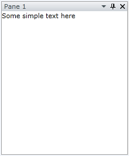
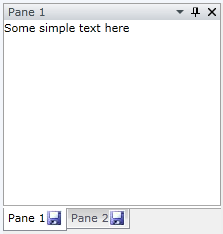

# How to Add Icon to the RadPane's Header

The purpose of this tutorial is to show you how to add an icon to the __RadPane's__ __Header__.

For the purpose of this tutorial the following __RadDocking__ declaration will be used:

#### __XAML__

```XAML
	<telerik:RadDocking x:Name="radDocking">
	
	    <telerik:RadSplitContainer>
	        <telerik:RadPaneGroup >
	            <telerik:RadPane Header="Pane 1">
	                <TextBlock Text="Some simple text here"/>
	            </telerik:RadPane>
	        </telerik:RadPaneGroup>
	    </telerik:RadSplitContainer>
	
	    <telerik:RadSplitContainer>
	        <telerik:RadPaneGroup >
	            <telerik:RadPane Header="Pane 2">
	                <TextBlock Text="Some simple text here"/>
	            </telerik:RadPane>
	        </telerik:RadPaneGroup>
	    </telerik:RadSplitContainer>
	
	</telerik:RadDocking>
```



In order to add an icon to the __RadPane's__ header, you should create a custom data template and set it to the __HeaderTemplate__ property of the __RadPane__. Consider the following example.

#### __XAML__

```XAML
	<UserControl.Resources>
	
	    <DataTemplate x:Key="HeaderTemplate">
	        <StackPanel Orientation="Horizontal">
	            <TextBlock Text="{Binding}"/>
	            <Image Source="Icon.jpg" Width="16" Height="16"/>
	        </StackPanel>
	    </DataTemplate>
	
	</UserControl.Resources>
```

Set the created data template to the __HeaderTemplate__ property of the __RadPane__.

#### __XAML__

```XAML
	<telerik:RadDocking x:Name="radDocking1">
	    <telerik:RadSplitContainer>
	        <telerik:RadPaneGroup>
	
	            <telerik:RadPane Header="Pane 1" HeaderTemplate="{StaticResource HeaderTemplate}">
	                <TextBlock Text="Some simple text here"/>
	            </telerik:RadPane>
	
	        </telerik:RadPaneGroup>
	    </telerik:RadSplitContainer>
	    <telerik:RadSplitContainer>
	        <telerik:RadPaneGroup >
	
	            <telerik:RadPane Header="Pane 2" HeaderTemplate="{StaticResource HeaderTemplate}">
	
	                <TextBlock Text="Some simple text here"/>
	            </telerik:RadPane>
	        </telerik:RadPaneGroup>
	    </telerik:RadSplitContainer>
	</telerik:RadDocking>
```

Here is the final result:



## See Also

 * [How to Freeze the Layout]()

 * [RadPane]()

 * [Save/Load Layout]()
