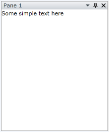
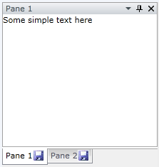

# How to Add Icon to the RadPane's Header

The purpose of this tutorial is to show you how to add an icon to the __RadPane's__ __Header__.

For the purpose of this tutorial the following __RadDocking__ declaration will be used:

<snippet id='raddocking-how-to-add-icon-pane-header-block_1-xaml' />

In order to add an icon to the __RadPane's__ header, you should create a custom data template and set it to the __HeaderTemplate__ property of the __RadPane__. Consider the following example.

<snippet id='raddocking-how-to-add-icon-pane-header-block_2-xaml' />

Set the created data template to the __HeaderTemplate__ property of the __RadPane__.

<snippet id='raddocking-how-to-add-icon-pane-header-block_3-xaml' />

Here is the final result:

## See Also

 * [How to Freeze the Layout]()

 * [RadPane]()

 * [Save/Load Layout]()
