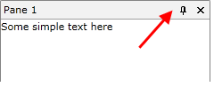

# How to Customize or Remove the RadPane's Menu

The purpose of this tutorial is to show you how to customize the __RadPane__menu.
      

>tipFor more information about the __RadPane__ structure, read [here]() or read [this one]() if you want to learn more about the __RadPane's__ menu.

## Customizing the RadPane's Menu

In order to add custom commands to the __RadPane's__ menu, you should perform the following steps:

1. Create a singleton property of type __Telerik.Windows.Controls.RoutedUICommand__. In the following example the custom command is named __CloseAllPanesButThis__.
	

#### __C#__

{{region raddocking-how-to-add-menu-items-to-the-radpanes-menu_0}}
	public static class RadDockingCommands
	{
		private static RoutedUICommand closeAllPanesButThisCommand;
	
		public static RoutedUICommand CloseAllPanesButThisCommand
		{
			get
			{
				if (closeAllPanesButThisCommand == null)
				{
					closeAllPanesButThisCommand = new RoutedUICommand("Close all panes but this", "CloseAllPanesButThisCommand", typeof(RadDockingCommands));
				}
				return closeAllPanesButThisCommand;
			}
		}
	}
	{{endregion}}

1. Create a custom __DataTemplate__by using the Telerik __RadContextMenu__ and __RadMenuItem__ controls. You can use either the built-in __RadDockingCommands__ or create a custom one - the both approaches are demonstrated in this topic. Set the created __DataTemplate__ to the __RadPane__'s __ContextMenuTemplate__ property. In the following code-snippet is shown how to set the __RadPane__'s __ContextMenuTemplate__ property.
          

#### __XAML__

{{region raddocking-how-to-add-menu-items-to-the-radpanes-menu_2_1}}
	<DataTemplate x:Key="ContextMenuTemplate">
		<telerik:RadContextMenu InheritDataContext="False">
			<telerik:RadMenuItem 
	                    IsChecked="{Binding IsFloatingOnly}"
	                    Command="telerik:RadDockingCommands.Floating" 
	                    CommandParameter="{Binding}"                
	                    CommandTarget="{Binding}"
	                    Header="{Binding Command.Text, RelativeSource={RelativeSource Self}}" />
	
			<telerik:RadMenuItem 
	                    IsChecked="{Binding IsDockableOptionChecked}" 
	                    Command="telerik:RadDockingCommands.Dockable" 
	                    CommandParameter="{Binding}"
	                    CommandTarget="{Binding}"
	                    Header="{Binding Command.Text, RelativeSource={RelativeSource Self}}" />
	
			<telerik:RadMenuItem 
	                    Command="local:RadDockingCommands.CloseAllPanesButThisCommand"
						CommandParameter="{Binding}" 
	                    CommandTarget="{Binding}"
	                    Header="{Binding Command.Text, RelativeSource={RelativeSource Self}}" />
		</telerik:RadContextMenu>
	</DataTemplate>
	
	
	{{endregion}}

1. You should implement your custom logic in the __OnCloseAllPanesButThis__ and __OnCloseAllPanesButThisCanExecute__ event handlers. The following code-snippet representis a sample logic for the handlers. 
          

#### __C#__

{{region raddocking-how-to-add-menu-items-to-the-radpanes-menu_4}}
	public static class RadDockingCommands
	{
		...
	
		public static void OnCloseAllPanesButThis(object sender, ExecutedRoutedEventArgs e)
		{
			var pane = e.Parameter as RadPane;
			if (pane != null)
			{
				var paneGroup = pane.PaneGroup;
				if (paneGroup != null)
				{
					var panesToClose = paneGroup.EnumeratePanes().Where(x => !x.IsHidden && x.IsPinned);
					foreach (var paneToClose in panesToClose)
					{
						if (paneToClose != pane)
						{
							paneToClose.IsHidden = true;
						}
					}
				}
			}
		}
	
		public static void OnCloseAllPanesButThisCanExecute(object sender, CanExecuteRoutedEventArgs e)
		{
			e.CanExecute = false;
			var paneGroup = sender as RadPaneGroup;
			if (paneGroup != null)
			{
				int childrenCount = paneGroup.EnumeratePanes().Count(x => !x.IsHidden && x.IsPinned);
	
				if (childrenCount > 1)
				{
					e.CanExecute = true;
				}
				else
				{
					e.CanExecute = false;
				}
			}
		}
	}
	{{endregion}}

1. Your menu command is ready and you have a custom __DataTemplate__, which is set to the __ContextMenuTemplate__ property. The next step is to register your custom command by using the __Telerik.Windows.Controls.CommandManager__ class. You can do that in the following manner:
	

#### __C#__

{{region raddocking-how-to-add-menu-items-to-the-radpanes-menu_3}}
	CommandManager.RegisterClassCommandBinding(
		typeof(RadPaneGroup), 
		new CommandBinding(
			RadDockingCommands.CloseAllPanesButThisCommand, 
			RadDockingCommands.OnCloseAllPanesButThis, 
			RadDockingCommands.OnCloseAllPanesButThisCanExecute));
	{{endregion}}

	Run your demo. The __RadPane__'s menu should look like the snapshot below.
	

         
      

## Removing the RadPane's Menu

In order to remove the __RadPane__'s Menu, you should set the __RadPane__'s __ContextMenuTemplate__ property to __null__ (respectively __{x:Null}__ in XAML).

#### __XAML__

{{region raddocking-how-to-add-menu-items-to-the-radpanes-menu_5}}
	<telerik:RadDocking x:Name="radDocking">
	    <telerik:RadDocking.DocumentHost>
	        <telerik:RadSplitContainer>
	            <telerik:RadPaneGroup>
	                <telerik:RadPane x:Name="radPane"
	                                    Title="Pane 1"
	                                    ContextMenuTemplate="{x:Null}">
	                    <TextBlock Text="Some simple text here" />
	                </telerik:RadPane>
	            </telerik:RadPaneGroup>
	        </telerik:RadSplitContainer>
	    </telerik:RadDocking.DocumentHost>
	</telerik:RadDocking>
	{{endregion}}

#### __C#__

{{region raddocking-how-to-add-menu-items-to-the-radpanes-menu_6}}
	radPane.ContextMenuTemplate = null;
	{{endregion}}

#### __VB.NET__

{{region raddocking-how-to-add-menu-items-to-the-radpanes-menu_7}}
	radPane.ContextMenuTemplate = Nothing
	{{endregion}}

         
      

# See Also

 * [How to Add Buttons to the Pane Header]()

 * [How to Disable the Close Button]()
