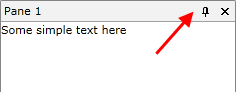

# How to Customize or Remove RadPane's Menu

The purpose of this tutorial is to show you how to customize __RadPane's__ menu.
      
>tip For more information about the __RadPane__ structure, read [here](). If you want to learn more about __RadPane's__ menu, read [this one]().

## Customizing RadPane's Menu 

To add custom commands to __RadPane's__ menu, you should perform the following steps:

1. You can create a custom class CustomRadDockingCommands. Inside, you can create a singleton property of type __Telerik.Windows.Controls.RoutedUICommand__. __Example 1__ demonstrates how you can do that.
	
	__Example 1: Create Singleton command property__
	<snippet id='raddocking-how-to-add-menu-items-to-the-radpanes-menu-example_1_create_singleton_command_property-cs' />

1. Create a custom __DataTemplate__ by using the Telerik's __RadContextMenu__ and __RadMenuItem__ controls. You can use either the built-in __RadDockingCommands__ or create a custom one - both approaches are demonstrated in this topic. Set the created __DataTemplate__ to __RadPane__'s __ContextMenuTemplate__ property. __Example 2__ show how to set __RadPane__'s __ContextMenuTemplate__ property.
          
	__Example 2: Custom DataTemplate for the ContextMenuTemplate property__
	<snippet id='raddocking-how-to-add-menu-items-to-the-radpanes-menu-example_2_custom_datatemplate_for_the_contextmenutemplate_property-xaml' />

1. You should implement your custom logic in the __OnCloseAllPanesButThis__ and __OnCloseAllPanesButThisCanExecute__ methods. They specify whether the command can be executed and what action is performed, when it is executed. __Example 3__ demonstrates sample logic for the command methods. 
          
	__Example 3: Implement Execute and CanExecute methods__
	<snippet id='raddocking-how-to-add-menu-items-to-the-radpanes-menu-example_3_implement_execute_and_canexecute_methods-cs' />

1. Your menu command is ready and you have a custom __DataTemplate__, which is set to the __ContextMenuTemplate__ property. The next step is to register your custom command by using the __Telerik.Windows.Controls.CommandManager__ class in the __CustomRadDockingCommands__ constructor. __Example 4__ shows the final structure of the __CustomRadDockingCommands__ class.
	
	__Example 4: Register CloseAllPanesButThisCommand custom command__
	<snippet id='raddocking-how-to-add-menu-items-to-the-radpanes-menu-example_4_register_closeallpanesbutthiscommand_custom_command-cs' />

Run your demo. __RadPane__'s menu should look like the snapshot below.

	
## Removing RadPane's Menu

In order to remove __RadPane__'s Menu, you should set __RadPane__'s __ContextMenuTemplate__ property to __null__ (respectively __{x:Null}__ in XAML).

__Example 5: Set ContextMenuTemplate property to null__

<snippet id='raddocking-how-to-add-menu-items-to-the-radpanes-menu-example_5_set_contextmenutemplate_property_to_null-xaml' />

__Example 6: Set ContextMenuTemplate property to null in code behind__

<snippet id='raddocking-how-to-add-menu-items-to-the-radpanes-menu-example_6_set_contextmenutemplate_property_to_null_in_code_behind-cs' />

<snippet id='raddocking-how-to-add-menu-items-to-the-radpanes-menu-example_6_set_contextmenutemplate_property_to_null_in_code_behind-vb' />

## See Also

 * [How to Add Buttons to the Pane Header]()
 * [How to Disable the Close Button]()
