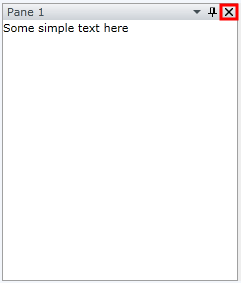
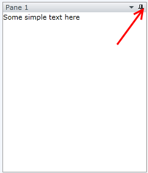
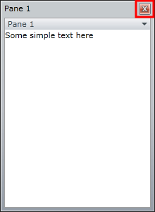

# How to Disable the Close Button

The purpose of this tutorial is to show you how to disable/hide the close ("X") button. 

For more information about the RadPane and its visual elements, read [here]().

There are two solutions for disabling the close button:

* Setting the __CanUserClose__ property

* Handling the __PreviewClose__ event

## Setting the CanUserClose Property

The first way to disable the close button is to simply __hide__ it. In order to do that you need to set the __CanUserClose__ property of the __RadPane__ to __False__. See the following example.

Here is a simple __RadDocking__ declaration with a single pane.


```XAML
	<telerik:RadDocking x:Name="radDocking">
	    <telerik:RadDocking.DocumentHost>
	        <telerik:RadSplitContainer>
	            <telerik:RadPaneGroup >
	                <telerik:RadPane x:Name="radPane" Title="Pane 1">
	                    <TextBlock Text="Some simple text here"></TextBlock>
	                </telerik:RadPane>
	            </telerik:RadPaneGroup>
	        </telerik:RadSplitContainer>
	    </telerik:RadDocking.DocumentHost>
	</telerik:RadDocking>
```

As you can see, by default the close button is enabled and you can close the pane anytime when you click the "X".



So, find your __RadPane__ declaration and set the following attribute:


```XAML
	<telerik:RadPane CanUserClose="False"/>
```

Now, if you run your application, the close button will be no longer visible.



The same operation can be done in the code-behind. In order to do that, set the __CanUserClose__ property on an instance of the __RadPane__ class to __false__.


```C#
	private void HideTheCloseButton()
	{
	    radPane.CanUserClose = false;
	}
```
```VB.NET
	Private Sub HideTheCloseButton()
		radPane.CanUserClose = False
	End Sub
```

>Note that even the __CanUserClose__ property is set to False, when you drag your pane so that you make it floatable. The window that contains the pane will still have a close button visible. __However, you won't be able to close if you try to click the "X" button.__



## Handling the PreviewClose Event

The second way to disable the close button is to handle the __PreviewClose__ event. So if you take a look again at the initial RadDocking declaration, attach to the __PreviewClose__ event of the __RadDocking__ class.


```XAML
	<telerik:RadDocking x:Name="radDocking1" PreviewClose="radDocking_PreviewClose">
```

Switch to the code-behind and add the following code in the event handler:


```C#
	private void radDocking_PreviewClose(object sender, Telerik.Windows.Controls.Docking.StateChangeEventArgs e)
	{
	    e.Handled = true;
	}
```
```VB.NET
	Private Sub radDocking_PreviewClose(ByVal sender As Object, ByVal e As StateChangeEventArgs)
		e.Handled = True
	End Sub
```

Run your application. Note that the close button is now visible. However, if you try to click, the pane won't close. The same is valid when your window is floatable.

## See Also

 * [Visual Structure]()

 * [How to Customize or Remove the RadPane's Menu]()

 * [How to Add Buttons to the Pane Header]()
