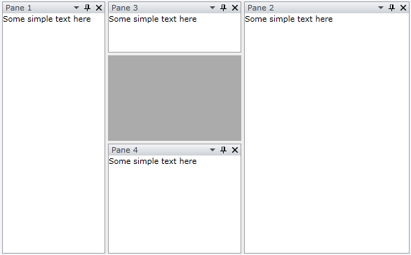
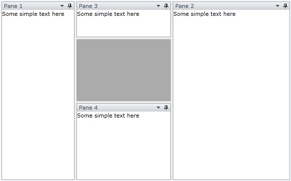
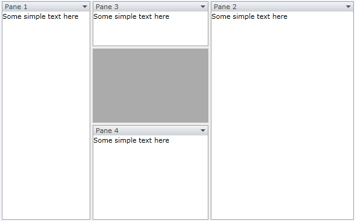
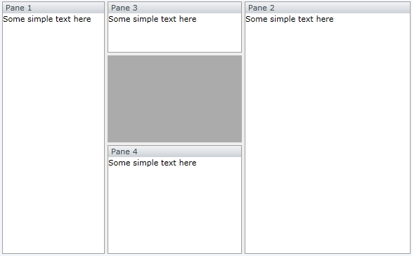

# How to Freeze the Layout

The purpose of this tutorial is to show you how to __freeze__ the entire layout of the __RadDocking__ control. That means to disable the:

* Moving and closing of panes

* Drop-down menu in the pane header

* Resizing of panes

For the purpose of this tutorial the following __RadDocking__ declaration will be used:

#### __XAML__

```XAML
	<telerik:RadDocking x:Name="radDocking">

	    <telerik:RadSplitContainer InitialPosition="DockedLeft">
	        <telerik:RadPaneGroup>
	            <telerik:RadPane x:Name="radPane1" Header="Pane 1">
	                <TextBlock Text="Some simple text here"/>
	            </telerik:RadPane>
	        </telerik:RadPaneGroup>
	    </telerik:RadSplitContainer>

	    <telerik:RadSplitContainer InitialPosition="DockedRight">
	        <telerik:RadPaneGroup>
	            <telerik:RadPane x:Name="radPane2" Header="Pane 2">
	                <TextBlock Text="Some simple text here"/>
	            </telerik:RadPane>
	        </telerik:RadPaneGroup>
	    </telerik:RadSplitContainer>

	    <telerik:RadSplitContainer InitialPosition="DockedTop">
	        <telerik:RadPaneGroup>
	            <telerik:RadPane x:Name="radPane3" Header="Pane 3">
	                <TextBlock Text="Some simple text here"/>
	            </telerik:RadPane>
	        </telerik:RadPaneGroup>
	    </telerik:RadSplitContainer>

	    <telerik:RadSplitContainer InitialPosition="DockedBottom">
	        <telerik:RadPaneGroup>
	            <telerik:RadPane x:Name="radPane4" Header="Pane 4">
	                <TextBlock Text="Some simple text here"/>
	            </telerik:RadPane>
	        </telerik:RadPaneGroup>
	    </telerik:RadSplitContainer>

	</telerik:RadDocking>
```



## Disable the Close ("X") Button

In order to disable the close button, you need to set the __CanUserClose__ property of the __RadPane__ to __False__. So find the __RadPane__ declarations and set the __CanUserClose__ property:

#### __XAML__

```XAML
	<!--...-->
	<telerik:RadPane x:Name="radPane10" Header="Pane 1" CanUserClose="False"/>
	<!--...-->
	<telerik:RadPane x:Name="radPane20" Header="Pane 2" CanUserClose="False"/>
	<!--...-->
	<telerik:RadPane x:Name="radPane30" Header="Pane 3" CanUserClose="False"/>
	<!--...-->
	<telerik:RadPane x:Name="radPane40" Header="Pane 4" CanUserClose="False"/>
```

Here is the result:



## Disable the Pin/Unpin Button

In order to disable the pin/unpin button, you need to set the __CanUserPin__ property of the __RadPane__ to __False__. So find the __RadPane__ declarations and set the __CanUserPane__ property:

#### __XAML__

```XAML
	<!--...-->
	<telerik:RadPane x:Name="radPane11" Header="Pane 1" CanUserClose="False" CanUserPin="False"/>
	<!--...-->
	<telerik:RadPane x:Name="radPane21" Header="Pane 2" CanUserClose="False" CanUserPin="False"/>
	<!--...-->
	<telerik:RadPane x:Name="radPane31" Header="Pane 3" CanUserClose="False" CanUserPin="False"/>
	<!--...-->
	<telerik:RadPane x:Name="radPane41" Header="Pane 4" CanUserClose="False" CanUserPin="False"/>
```

Here is the result:



## Disable the Float Behavior

In order to disable the float behavior, you need to set the __CanFloat__ property of the __RadPane__ to __False__. Which means that the user will not be able to drag and drop the panes. So find the __RadPane__ declarations and set the __CanFloat__ property:

#### __XAML__

```XAML
	<!--...-->
	<telerik:RadPane x:Name="radPane12" Header="Pane 1" CanUserClose="False" CanUserPin="False" CanFloat="False"/>
	<!--...-->
	<telerik:RadPane x:Name="radPane22" Header="Pane 2" CanUserClose="False" CanUserPin="False" CanFloat="False"/>
	<!--...-->
	<telerik:RadPane x:Name="radPane32" Header="Pane 3" CanUserClose="False" CanUserPin="False" CanFloat="False"/>
	<!--...-->
	<telerik:RadPane x:Name="radPane42" Header="Pane 4" CanUserClose="False" CanUserPin="False" CanFloat="False"/>
```

## Disable the Drop-Down Menu in the Pane Header

In order to remove the menu from the __RadPane__, you need to remove all the menu items from the  __MenuCommands__ collection of each __RadPane__ control that doesn't need a menu.

Switch to the code-behind and clear the __MenuCommands__ collection of each __RadPane__.

#### __C#__

```C#
	private void DisableMenu()
	{
	    radPane1.ContextMenuTemplate = null;
	    radPane2.ContextMenuTemplate = null;
	    radPane3.ContextMenuTemplate = null;
	    radPane4.ContextMenuTemplate = null;
	}
```

#### __VB.NET__

```VB.NET
	Private Sub DisableMenu()
		radPane1.ContextMenuTemplate = Nothing
		radPane2.ContextMenuTemplate = Nothing
		radPane3.ContextMenuTemplate = Nothing
		radPane4.ContextMenuTemplate = Nothing
	End Sub
```

Here is the result:



## Disable Resizing of the Panes

In order to disable the pane resizing, you need to use the __MinWidth__, __MinHeight__, __MaxWidth__ and __MaxHeight__ properties of the __RadSplitContainer__.

## See Also

 * [How to Customize or Remove the RadPane's Menu]()

 * [Visual Structure]()

 * [RadPane]()
