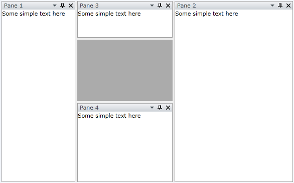
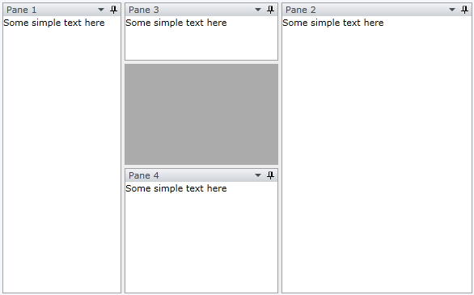
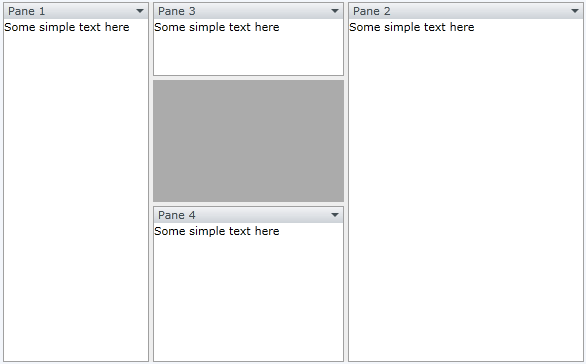
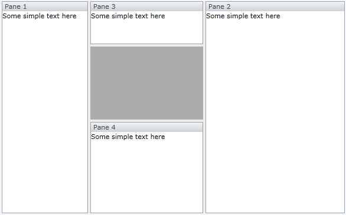

# How to Freeze the Layout

The purpose of this tutorial is to show you how to __freeze__ the entire layout of the __RadDocking__ control. That means to disable the:

* Moving and closing of panes

* Drop-down menu in the pane header

* Resizing of panes

For the purpose of this tutorial the following __RadDocking__ declaration will be used:

<snippet id='raddocking-how-to-freeze-the-layout-block_1-xaml' />

## Disable the Close ("X") Button

In order to disable the close button, you need to set the __CanUserClose__ property of the __RadPane__ to __False__. So find the __RadPane__ declarations and set the __CanUserClose__ property:

<snippet id='raddocking-how-to-freeze-the-layout-block_2-xaml' />

Here is the result:

## Disable the Pin/Unpin Button

In order to disable the pin/unpin button, you need to set the __CanUserPin__ property of the __RadPane__ to __False__. So find the __RadPane__ declarations and set the __CanUserPane__ property:

<snippet id='raddocking-how-to-freeze-the-layout-block_3-xaml' />

Here is the result:

## Disable the Float Behavior

In order to disable the float behavior, you need to set the __CanFloat__ property of the __RadPane__ to __False__. Which means that the user will not be able to drag and drop the panes. So find the __RadPane__ declarations and set the __CanFloat__ property:

<snippet id='raddocking-how-to-freeze-the-layout-block_4-xaml' />

## Disable the Drop-Down Menu in the Pane Header

In order to remove the menu from the __RadPane__, you need to remove all the menu items from the  __MenuCommands__ collection of each __RadPane__ control that doesn't need a menu.

Switch to the code-behind and clear the __MenuCommands__ collection of each __RadPane__.

<snippet id='raddocking-how-to-freeze-the-layout-block_5-cs' />

<snippet id='raddocking-how-to-freeze-the-layout-block_5-vb' />

Here is the result:

## Disable Resizing of the Panes

In order to disable the pane resizing, you need to use the __MinWidth__, __MinHeight__, __MaxWidth__ and __MaxHeight__ properties of the __RadSplitContainer__.

## See Also

 * [How to Customize or Remove the RadPane's Menu]()

 * [Visual Structure]()

 * [RadPane]()
