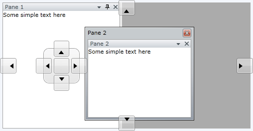
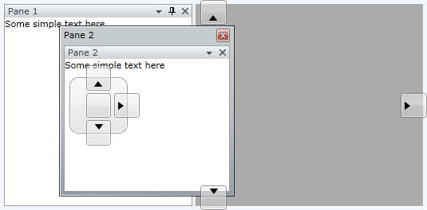
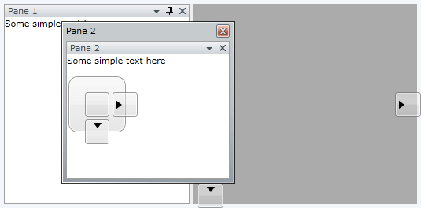
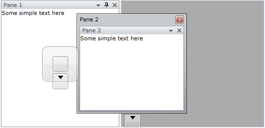
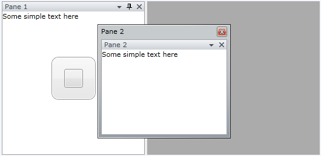

# How to Implement Conditional Docking

There are cases, in which you want to __disable__ the user's ability to __dock__ panes to any of the sides. In this case you need to implement conditional docking.

You could use the __PreviewShowCompass__ event of the __RadDocking__ control in combination with the __Is<*>IndicatorVisible__ series of properties of the __Compass__ class. Where <*> could be one of the following:

* __Left__

* __Top__

* __Right__

* __Bottom__

* __Center__

For the purpose of this tutorial, the following __RadDocking__ declaration will be used:

<snippet id='raddocking-how-to-implement-conditional-docking-block_1-xaml' />

When you try to drag and dock the "Pane 2", then all [compass indicators]() are available.

In order to implement conditional docking, you need to perform the following instructions.

Attach to the __PreviewShowCompass__ event of the __RadDocking__ control.

<snippet id='raddocking-how-to-implement-conditional-docking-block_2-xaml' />

Switch to the code-behind. The __PreviewShowCompassEventArgs__ exposes a __Compass__ property. You need to use the __Is<*>IndicatorVisible__ series of properties of the __Compass__ class in order to disable any of the compass indicators.

* __IsLeftIndicatorVisible__ - If you want to disable the left compass indicator, then set the __IsLeftIndicatorVisible__ property of the passed event arguments to __False__. 

<snippet id='raddocking-how-to-implement-conditional-docking-block_3-cs' />

<snippet id='raddocking-how-to-implement-conditional-docking-block_3-vb' />

* __IsTopIndicatorVisible__ - If you want to disable the top compass indicator, then set the __IsTopIndicatorVisible__ property of the passed event arguments to __False__. 

<snippet id='raddocking-how-to-implement-conditional-docking-block_4-cs' />

<snippet id='raddocking-how-to-implement-conditional-docking-block_4-vb' />

 

* __IsRightIndicatorVisible__ - If you want to disable the right compass indicator, then set the __IsRightIndicatorVisible__ property of the passed event arguments to __False__. 

<snippet id='raddocking-how-to-implement-conditional-docking-block_5-cs' />

<snippet id='raddocking-how-to-implement-conditional-docking-block_5-vb' />

* __IsBottomIndicatorVisible__ - If you want to disable the bottom compass indicator, then set the __IsBottomIndicatorVisible__ property of the passed event arguments to __False__. 

<snippet id='raddocking-how-to-implement-conditional-docking-block_6-cs' />

<snippet id='raddocking-how-to-implement-conditional-docking-block_6-vb' />

* __IsCenterIndicatorVisible__ - If you want to disable the center compass indicator, then set the __IsCenterIndicatorVisible__ property of the passed event arguments to __False__. 

<snippet id='raddocking-how-to-implement-conditional-docking-block_7-cs' />

<snippet id='raddocking-how-to-implement-conditional-docking-block_7-vb' />

In the last case, all compass indicators are disabled.

>tip There is an alternative approach to disable the docking. You need to set the initial position of the [RadSplitContainer]() to __FloatingOnly__.

## See Also

 * [Compass]()

 * [Drag and Drop]()

 * [How to Freeze the Layout]()
