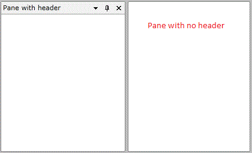
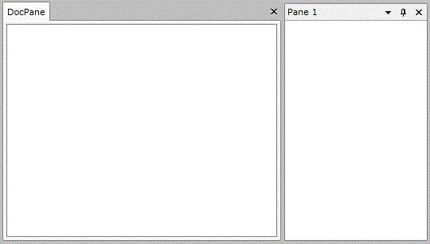
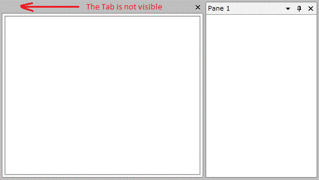
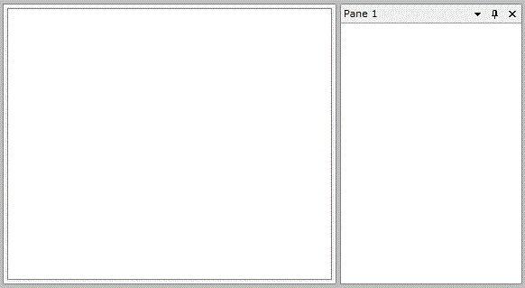

# How to Remove the Header of the RadPane

The purpose of this tutorial is to show how to remove the __Header__ of the RadPane.

For more information about the RadPane and its visual elements, read [here]().

## Removing the RadPane’s Header

In order to remove the __Header__ of the __RadPane__ you have to set the __PaneHeaderVisibility__ property to __Collapsed__.

#### __XAML__

{{region raddocking-how-to-remove-the-header-of-the-radpane_0}}
	<telerik:RadDocking Grid.Row="1">
	    <telerik:RadSplitContainer InitialPosition="DockedBottom">
	           <telerik:RadPaneGroup>
	                   <telerik:RadPane Header="Pane with header"/>
	                   <telerik:RadPane PaneHeaderVisibility="Collapsed"/>
	             </telerik:RadPaneGroup>
	     </telerik:RadSplitContainer>
	</telerik:RadDocking>
	{{endregion}}

After that the Panes will look like this:

         
      

## Removing the RadDocumentPane’s Tab

This is commonly misinterpreted as the RadPane’s Header, but here the __PaneHeaderVisibility__ is not the property we need. The Tab of the __RadDocumentPane__ is actually the Pane itself.

         
      

So to remove it and to leave only the border of the DocumentPane in the DocumentHost you will have to set its its __Visibility__ property to __Collapsed__.

#### __XAML__

{{region raddocking-how-to-remove-the-header-of-the-radpane_1}}
	<telerik:RadDocking>
	     <telerik:RadDocking.DocumentHost>
	           <telerik:RadSplitContainer>
	                <telerik:RadPaneGroup x:Name="docHostSplitContainer">
	                            <telerik:RadDocumentPane Header="DocPane" Visibility="Collapsed"/>
	                 </telerik:RadPaneGroup>
	            </telerik:RadSplitContainer>
	      </telerik:RadDocking.DocumentHost>
	    <telerik:RadSplitContainer InitialPosition="DockedRight">
	          <telerik:RadPaneGroup>
	                 <telerik:RadPane Header="Pane 1"/>
	           </telerik:RadPaneGroup>
	     </telerik:RadSplitContainer>
	</telerik:RadDocking>
	{{endregion}}

         
      

If you set the __CanUserClose__ property of the __RadDocumentPane__ the 'X' button will disappear as long with the grey area. 

         
      
