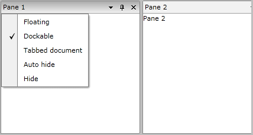
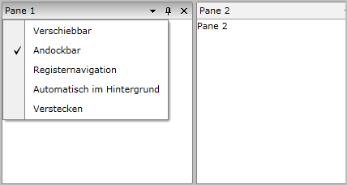

# Localization

The built-in localization mechanism in Silverlight and WPF allows you to localize any string resource used by the RadDocking control. Once translated, you might use your resources in both Silverlight and WPF projects without changing anything.

>tip To learn more about the ways to localize UI for SilverlightWPF please read the common topic about [Localization]()[Localization]().

In __RadDocking__ you can localize the context menu:

The next image shows the context menu localized in German: 

## Supported Languages

__RadDocking__ can be translated in one of the following supported languages using the framework’s localization mechanism:

* English
* German
* Spanish
* French
* Italian
* Dutch
* Turkish

More information on how to achieve this you can find in the [Localization Using Built-in Resources] () article.

## Resource Keys

The resources of the control can be localized by using an unique identifier called resource key that is assigned to each localizable string. Below you may find a list of the Resources available and their default values:

Key	|	Value
---	|	---
Hide	|	Hide
Auto_hide	|	Auto hide
Floating	|	Floating
Dockable	|	Dockable
Tabbed_document	|	Tabbed document
Docking_ActivePanes | Active Panes
Docking_ActiveDocuments | Active Documents
Docking_PreviewHeader | Preview

## See Also

 * [How to Add Buttons to the Pane Header]()

 * [How to Add Icon to the RadPane's Header]()
