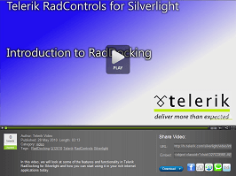

# Overview








Thank you for choosing Telerik RadDocking!

Are you comfortable handling multiple windows in your application? Save yourself the hassle with __RadDocking__ for SilverlightWPF – a docking system like the one in Microsoft Visual Studio. You get the dockable ToolWindows, a hidden DockingManager control, and a designer to make the creation of attractive layouts easy.
        

__RadDocking__ key features list: 

* __Save/Load Layout__

* __Split Containers__

* __Tabbed Documents__

* __Pin/Unpin and Hide Panes__

* __Dockable Windows__

* __Floating Windows__

* __Nested RadDocking Support__

* __WPF/Silverlight Code Compatibility__

* __All Telerik controls for__

* __Events Routed strong__

* __Codeless Test Automation for Docking__

A complete list with all the key features can be found [here]()


Check out the online demo at: [http://demos.telerik.com/silverlight/default.aspx#Docking/FirstLook](http://demos.telerik.com/silverlight/default.aspx#Docking/FirstLook)


Check out the online demo at: [http://demos.telerik.com/wpf/](http://demos.telerik.com/wpf/)



In the following video, we will look at some of the features and functionality in Telerik RadDocking for Silverlight and how you can start using it in your rich internet applications today.(Runtime: 03:13)


