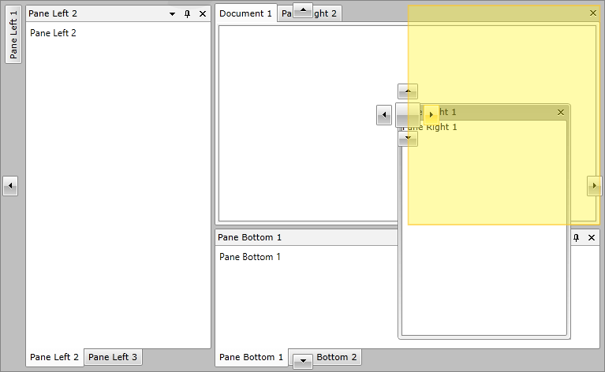

# Overview








Thank you for choosing Telerik ® RadDocking!

Are you comfortable handling multiple windows in your application? Save yourself the hassle with __RadDocking__ for {{ site.framework_name }} – a docking system like the one in Microsoft Visual Studio. You get the dockable ToolWindows, a hidden DockingManager control, and a designer to make the creation of attractive layouts easy.
        

__RadDocking__'s key features include: 

* __Save/Load Layout__

* __Split Containers__

* __Tabbed Documents__

* __Pin/Unpin and Hide Panes__

* __Dockable Windows__

* __Floating Windows__

* __Nested RadDocking Support__

* __WPF/Silverlight Code Compatibility__

* __All Telerik controls for__

* __Events Routed strong__

* __Codeless Test Automation for Docking__

The complete list of features can be found [here]().


Check out the online demos available at: [https://demos.telerik.com/silverlight/default.aspx#Docking/FirstLook](https://demos.telerik.com/silverlight/default.aspx#Docking/FirstLook)


Check out the online demos available at: [https://demos.telerik.com/wpf/](https://demos.telerik.com/wpf/)


## See Also

* [Getting Started]()
* [Pane Groups]()
* [Split Container]()
* [Tool Window]()
* [RadDocking API Reference](https://docs.telerik.com/devtools/wpf/api/html/t_telerik_windows_controls_raddocking.htm)
