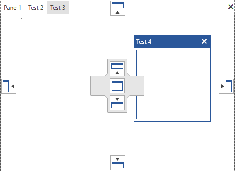

# Styling the Compass

The compasses that you see, when rearranging the containers in the __RadDocking__ control, are represented by the __Compass__ and __RootCompass__ controls. The one shown inside the container under the mouse is the [Compass](#compass) control.

## Targeting the Compass Element

In order to style all __Compass__ elements in a RadDocking, you should create a style targeting __Compass__ and set it to the __CompassStyle__ property of the RadDocking.

__Example 1: Setting the CompassStyle property__

```XAML
	<Application.Resources>
		<!-- If you are using the NoXaml binaries, you will have to base the style on the default one for the theme like so: 
		<Style x:Key="CustomCompassStyle" TargetType="telerik:Compass" BasedOn="{StaticResource CompassStyle}">-->
		
		<Style x:Key="CustomCompassStyle" TargetType="telerik:Compass">
			<Setter Property="IsLeftIndicatorVisible" Value="False" />
			<Setter Property="IsRightIndicatorVisible" Value="False" />
		</Style>
	</Application.Resources>

	<Grid>
        <telerik:RadDocking  x:Name="radDocking" CompassStyle="{StaticResource CustomCompassStyle}">
            <telerik:RadDocking.DocumentHost>
                <telerik:RadSplitContainer >
                    <telerik:RadPaneGroup >
                        <telerik:RadPane Header="Pane 1" />
                        <telerik:RadPane Header="Test 2"/>
                        <telerik:RadPane Header="Test 3" />
                        <telerik:RadPane Header="Test 4" />
                    </telerik:RadPaneGroup>
                </telerik:RadSplitContainer>
            </telerik:RadDocking.DocumentHost>
        </telerik:RadDocking>
    </Grid>
```

#### __Figure 1: Compass without left and right indicator in the Office2016 theme__


>tip In order to learn how to further modify the control by extracting its ControlTemplate, read the [Editing Control Templates]() article.

## See Also

 * [Compass]()
 * [Drag and Drop]()
 * [Styling the RootCompass]()
 * [Styling the Visual Cue]()
