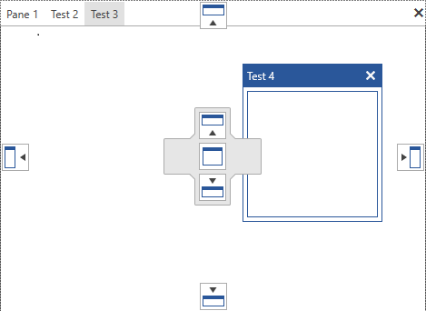

# Styling the Compass

The compasses that you see, when rearranging the containers in the __RadDocking__ control, are represented by the __Compass__ and __RootCompass__ controls. The one shown inside the container under the mouse is the [Compass](#compass) control.

## Targeting the Compass Element

In order to style all __Compass__ elements in a RadDocking, you should create a style targeting __Compass__ and set it to the __CompassStyle__ property of the RadDocking.

__Example 1: Setting the CompassStyle property__

<snippet id='raddocking-styles-and-templates-styling-the-compass-example_1_setting_the_compassstyle_property-xaml' />

#### __Figure 1: Compass without left and right indicator in the Office2016 theme__

>tip In order to learn how to further modify the control by extracting its ControlTemplate, read the [Editing Control Templates]() article.

## See Also

 * [Compass]()
 * [Drag and Drop]()
 * [Styling the RootCompass]()
 * [Styling the Visual Cue]()
