# Styling the Pane Header

>As the __PaneHeader__ is created dynamically you cannot set the style for it declaratively. The easiest way to do this is to create a theme for your __RadDocking__ control, add the created style for the __PaneHeader__ in it and apply the theme to the control. To learn how to do it read [this]() topic.

To create the needed style for the __Theme__ you should use a dummy control. This will allow you to copy the default style for the __PaneHeader__ and modify it to your liking. To do so open the UserControl that hosts your __RadDocking__ in Expression Blend.

From the 'Assets' tab select *Controls -> All -> PaneHeader*.

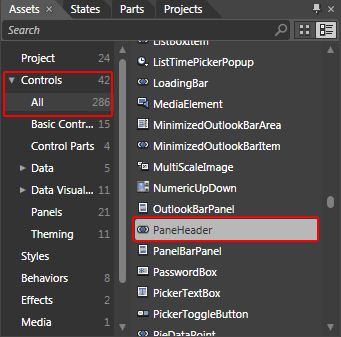

Draw one dummy control of this type somewhere on the scene.

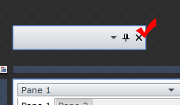

Select it and from the menu choose *Object -> Edit Style -> Edit a Copy. *You will be prompted for the name of the style and where to be placed within your application.

>tipIf you choose to define the style in Application, it would be available for the entire application. This allows you to define a style only once and then reuse it where needed.

After clicking OK, a style for your __PaneHeader__ control will be created.

Go to the 'Resources' pane and see the resources generated for your style.

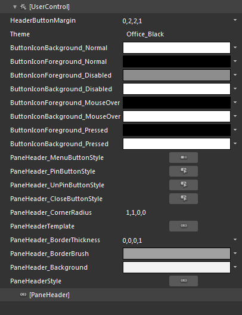

The default pane header's template consists of the following elements:

* __Content__ - is of type __Grid__ and represents the host container of the pane's header. 

* __TitleElement__ - is a __ContentControl__ showing the pane's title. 

* __HeaderDropDownMenu__ - is of type __RadToggleButton__ and toggles a drop-down menu.

* __Grid__ - contains the following buttons:  

	* __HeaderPinButton__ - is of type __RadButton__ and is used to pin the pane to its current state.

	* __HeaderUnPinButton__ - is of type __RadButton__ and unpins the pane.  

* __HeaderCloseButton__ - is of type __RadButton__ and is the pane's close button. 

Each of the buttons defined in the header's default template has a corresponding default style. To change the header's appearance you can modify the brush resources used in the different states. The states in each of these buttons default templates are as follows:

* __Norma__ - the button's normal state. 

* __Disabled__ - is active when the button cannot be pressed. 

* __MouseOver__- is active when the mouse is over the button. 

* __Pressed__ - is active when the button is pressed. 

For each state a couple of brushes are available:

* __ButtonIconBackground___*__StateName__* - defines the background brush used for all the header's buttons (described above) in the specified state - one of the common states in a __RadButton's__ default template (also mentioned above). 

* __ButtonIconForeground___*__StateName__* - defines the foreground brush used for all the header's buttons (described above) in the specified state.

>tipFor more information about the __RadButton's__ styles and templates, look [here](http://www.telerik.com/help/silverlight/radbuttons-styles-and-templates-overview.html). 

 



Here is an example of the described resources modified.

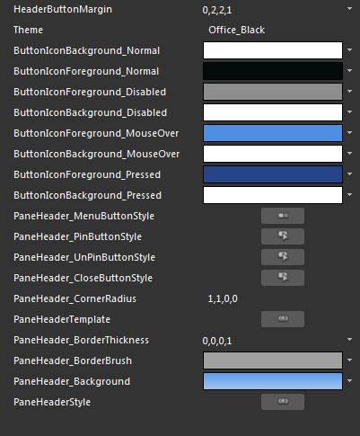

The most of the customizations of the __PaneHeader__ are to be made in the template of the control. To modify it click on the palette-like breadcrumb icon and select *EditTemplate -> Edit Current*.

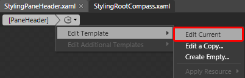

From the 'Objects and Timeline' pane select the __RootVisual__ control.

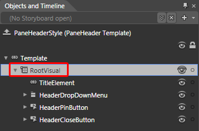

Modify its __Background__ property. This will change the background color of the __PaneHeader__ control.



To change the background color of the __PaneHeader__, when it is selected you have to modify the trigger responsible for that. From the 'Triggers' pane select the one available trigger.

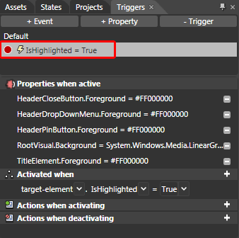

When the trigger is selected every change you made will be recorded by it. So from the 'Objects and Timeline' pane select the __RootVisual__ control again and change its value.

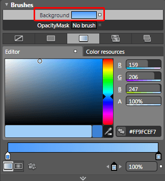

To change the visual appearance of the __PaneHeader__'s Buttons you have to modify their templates. For example select the __HeaderCloseButton__.

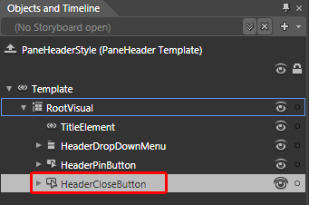

Right-Clik on it and choose *Edit Template -> Edit Current*. This will bring you into editing the template of the button. From the 'Triggers' pane select the trigger responsible for changing the appearance of the button when the mouse is over it.

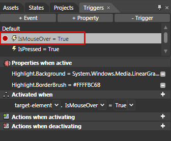

From the 'Objects and Timeline' select the __Highlight__ control.

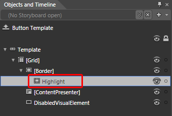

Modify its __Background__ and __BroderBrush__ properties. This will change the background and the color of the border of the button.

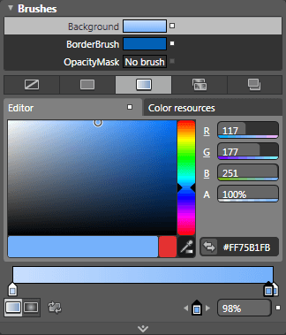

You can modify the other triggers used in the button's template as well.

After finishing with the modifications, you have to add the created style to the theme for your __RadDocking__. To learn how take a look at the [Theming the Pane Header]() topic.

After moving the style to the theme you can remove it from the resources of your UserControl. Also don't forget to delete the dummy control that you have created.

Here is a snapshot of the final result.

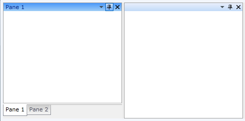

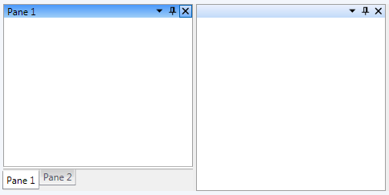

# See Also

 * [Styling and Appearance - Overview]()

 * [RadPane]()

 * [Theming the Pane Header]()

 * [How to Add Buttons to the Pane Header]()

 * [How to Add Icon to the RadPane's Header]()
