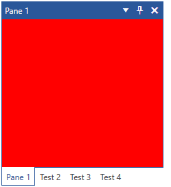

# Styling the RadPaneGroup

The [RadPaneGroup]() control groups multiple RadPanes in a single container. This article will demonstrate how you can style the control.

## Targeting the RadPaneGroup Element

In order to style all __RadPaneGroups__ in a RadDocking, you should create a style targeting __RadPaneGroup__.

__Example 1: Creating an implicit style targeting RadPaneGroup__

```XAML
    <Application.Resources>
        <!-- If you are using the NoXaml binaries, you will have to base the style on the default one for the theme like so: 
        <Style TargetType="telerik:RadPaneGroup" BasedOn="{StaticResource RadPaneGroupStyle}"> -->

        <Style TargetType="telerik:RadPaneGroup">
            <Setter Property="Background" Value="Red" />
        </Style>
    </Application.Resources>

    <Grid>
        
        <telerik:RadDocking>
            <telerik:RadSplitContainer>
                <telerik:RadPaneGroup>
                    <telerik:RadPane Header="Pane 1" />
                    <telerik:RadPane Header="Test 2"/>
                    <telerik:RadPane Header="Test 3" />
                    <telerik:RadPane Header="Test 4" />
                </telerik:RadPaneGroup>
            </telerik:RadSplitContainer>
        </telerik:RadDocking>
    </Grid>
```

#### __Figure 1: Styled RadPaneGroup in the Office2016 theme__


>tip In order to learn how to further modify the control by extracting its ControlTemplate, read the [Editing Control Templates]() article.

## See Also   
 * [Pane Groups]()
 * [RadPane]()
 * [Styling the RadPane]()
