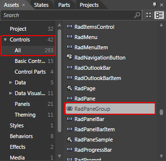
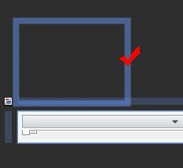
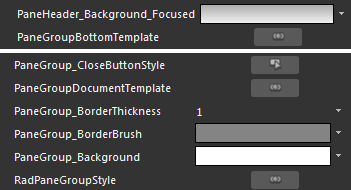
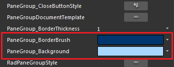
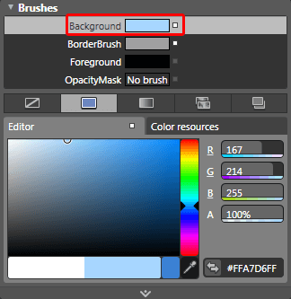
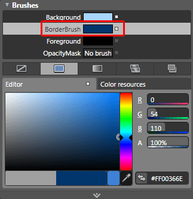

# Styling the RadPaneGroup

## 

>As the __RadPaneGroup__ is created dynamically, you cannot set the style for it declaratively. The easiest way to do this is to create a theme for your __RadDocking__ control, add the created style for the __RadPaneGroup__ in it and apply the theme to the control. To learn how to do it read [this]() topic.

To create the needed style for the __Theme__ you should use a dummy control. This will allow you to copy the default style for the __RadPaneGroup__ and modify it to your liking. To do so open the UserControl that hosts your __RadDocking__ in Expression Blend.

From the 'Assets' tab select *Controls -> All -> RadPaneGroup*.

         
      

Draw one dummy control of this type somewhere on the scene.

         
      

>tipAfter drawing the __RadPaneGroup__, you won't be able to see it on the scene.

Select it and from the menu choose *Object -> Edit Style -> Edit a Copy*. You will be prompted for the name of the style and where to be placed within your application.

After clicking OK, a style for your __RadPaneGroup__ control will be created.

Go to the 'Properties' pane and edit the desired properties. For example, select the __Background__property and see to which local brush it is bound.

         
      

Here is an example of the above resources modified:

         
      

Go to the 'Properties' pane and edit the desired properties. For example, select the __Background__property and modify its value.

         
      

Modify the __BorderBrush__ property too.

         
      

After finishing with the modifications you have to add the created style to the theme for your __RadDocking__. To learn how take a look at the [Theming the RadPaneGroup]() topic.

After moving the style to the theme you can remove it from the resources of your UserControl. Also don't forget to delete the dummy control that you have created.

Here is a snapshot of the final result.

         
      

# See Also

 * [Styling and Appearance - Overview]()

 * [Pane Groups]()

 * [RadPane]()

 * [Theming the RadPaneGroup]()

 * [Styling the RadPane]()
