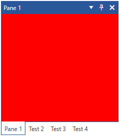

# Styling the RadPaneGroup

The [RadPaneGroup]() control groups multiple RadPanes in a single container. This article will demonstrate how you can style the control.

## Targeting the RadPaneGroup Element

In order to style all __RadPaneGroups__ in a RadDocking, you should create a style targeting __RadPaneGroup__.

__Example 1: Creating an implicit style targeting RadPaneGroup__

<snippet id='raddocking-styles-and-templates-styling-the-radpanegroup-example_1_creating_an_implicit_style_targeting_radpanegroup-xaml' />

#### __Figure 1: Styled RadPaneGroup in the Office2016 theme__

>tip In order to learn how to further modify the control by extracting its ControlTemplate, read the [Editing Control Templates]() article.

## See Also   
 * [Pane Groups]()
 * [RadPane]()
 * [Styling the RadPane]()
