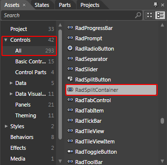
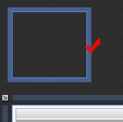
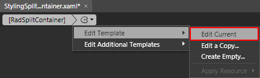
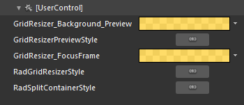
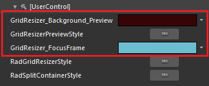
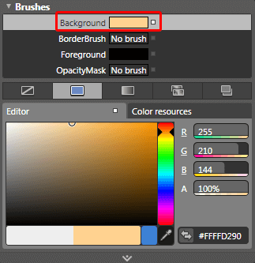
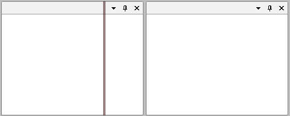

# Styling the RadSplitContainer

## 

>As the __RadSplitContainer__ is created dynamically you cannot set the style for it declaratively. The easiest way to do this is to create a theme for your __RadDocking__ control, add the created style for the __RadSplitContainer__ in it and apply the theme to the control. To learn how to do it read [this]() topic.

To create the needed style for the Theme you should use a dummy control. This will allow you to copy the default style for the __RadSplitContainer__ and modify it to your liking. To do so open the UserControl that hosts your __RadDocking__ in Expression Blend.

From the Assets tab select *Controls -> All -> RadSplitContainer*.

         
      

Draw one dummy control of this type somewhere on the scene.

         
      

Select it and from the menu choose *Object -> Edit Style -> Edit a Copy*. You will be prompted for the name of the style and where to be placed within your application.

After clicking OK, a style for your __RadSplitContainer__ control will be created and the properties that can be set through it will be loaded in the 'Properties' pane. 

Now go to the template of the __RadSplitContainer__ control, so you can style the __DockResizer__ control.

         
      

The __DockResizer__ control holds the visual elements that regard the resizing functionality. Select it from the 'Objects and Timeline' pane.

From the menu select Object -> *Edit Style -> Edit a Copy. *You will be prompted for the name of the style and where to be placed within your application.

After clicking OK, a style for your __RadGridResizer__ control will be created and the properties that can be set through it will be loaded in the 'Properties' pane.

Go to the 'Resources' pane and see all of the resources generated for your style.

         
      

* 

__GridResizer_Background_Preview__ - is the __RadGridResizer's__ background brush. 

* 

__GridResizerPreviewStyle__ - defines the preview style for the __RadGridResizer__.

* 

__GridResizer_FocusFrame__ - is the __Stroke__ used for the rectangle visible while the __RadGridResizer__control is focussed.

Here is an example of the above resources modified:

         
      

For example select the __Background__ property and modify its value.

         
      

After finishing with the modifications you have to add the created style to the theme for your __RadDocking__. To learn how to do this take a look at the [Theming the RadSplitContainer]() topic.

After moving the style to the theme you can remove it from the resources of your UserControl. Also don't forget to delete the dummy control that you have created.

Here is a snapshot of the final result.

         
      

         
      

# See Also

 * [Styling and Appearance - Overview]()

 * [Split Container]()

 * [Theming the RadSplitContainer]()

 * [Pane Groups]()
