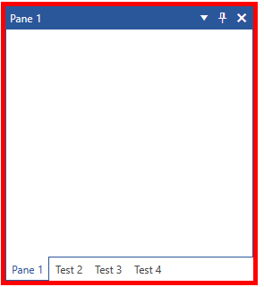

# Styling the RadSplitContainer

The [RadSplitContainer]() allows you to use movable bars to divide the displayed area into resizable parts. This article will demonstrate how to style the control.

## Targeting the RadSplitContainer Element

In order to style all __RadSplitContainers__ in a RadDocking, you should create a style targeting __RadSplitContainer__.

__Example 1: Creating an implicit style targetting RadSplitContainer__

```XAML
    <Application.Resources>
        <!-- If you are using the NoXaml binaries, you will have to base the style on the default one for the theme like so: 
        <Style TargetType="telerik:RadSplitContainer" BasedOn="{StaticResource RadSplitContainerStyle}">-->

        <Style TargetType="telerik:RadSplitContainer">
            <Setter Property="BorderBrush" Value="Red" />
            <Setter Property="BorderThickness" Value="5" />
        </Style>
    </Application.Resources>

    <Grid>
        <telerik:RadDocking  x:Name="radDocking" >
            <telerik:RadSplitContainer >
                <telerik:RadPaneGroup >
                    <telerik:RadPane Header="Pane 1" />
                    <telerik:RadPane Header="Test 2"/>
                    <telerik:RadPane Header="Test 3" />
                    <telerik:RadPane Header="Test 4" />
                </telerik:RadPaneGroup>
            </telerik:RadSplitContainer>
        </telerik:RadDocking>
    </Grid>
```

#### __Figure 1: Styled RadSplitContainer in the Office2016 theme__


>tip In order to learn how to further modify the control by extracting its ControlTemplate, read the [Editing Control Templates]() article.

## See Also   
 * [Split Container]()
 * [Pane Groups]()
