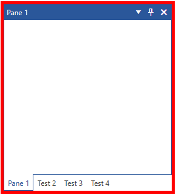

# Styling the RadSplitContainer

The [RadSplitContainer]() allows you to use movable bars to divide the displayed area into resizable parts. This article will demonstrate how to style the control.

## Targeting the RadSplitContainer Element

In order to style all __RadSplitContainers__ in a RadDocking, you should create a style targeting __RadSplitContainer__.

__Example 1: Creating an implicit style targetting RadSplitContainer__

<snippet id='raddocking-styles-and-templates-styling-the-radsplitcontainer-example_1_creating_an_implicit_style_targetting_radsplitcontainer-xaml' />

#### __Figure 1: Styled RadSplitContainer in the Office2016 theme__

>tip In order to learn how to further modify the control by extracting its ControlTemplate, read the [Editing Control Templates]() article.

## See Also   
 * [Split Container]()
 * [Pane Groups]()
