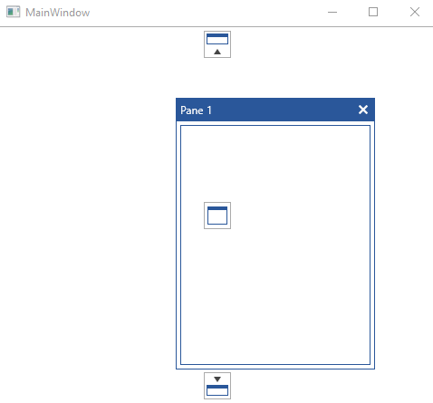

# Styling the RootCompass

The compasses that you see, when rearranging the containers in the __RadDocking__ control, are represented by the __Compass__ and __RootCompass__ controls. The one that marks the possible docking positions within the root container is the [RootCompass](#root-compass) control. This article will demonstrate how to create a style targeting RootCompass.

## Targeting the RootCompass Element

In order to style the __RootCompass__ element in a RadDocking, you should create a style targeting __RootCompass__ and set it to the __RootCompassStyle__ property of the RadDocking.

__Example 1: Setting the RootCompassStyle property__

```XAML
	<Application.Resources>
		<!-- If you are using the NoXaml binaries, you will have to base the style on the default one for the theme like so: 
		<Style x:Key="CustomRootCompassStyle" TargetType="telerik:RootCompass" BasedOn="{StaticResource RootCompassStyle}">-->

		<Style x:Key="CustomRootCompassStyle" TargetType="telerik:RootCompass">
			<Setter Property="IsLeftIndicatorVisible" Value="False" />
			<Setter Property="IsRightIndicatorVisible" Value="False" />
		</Style>
	</Application.Resources>

	<Grid>
        <telerik:RadDocking RootCompassStyle="{StaticResource CustomRootCompassStyle}">
            <telerik:RadSplitContainer InitialPosition="FloatingDockable">
                <telerik:RadPaneGroup >
                    <telerik:RadPane Header="Pane 1"/>
                </telerik:RadPaneGroup>
            </telerik:RadSplitContainer>
        </telerik:RadDocking>
    </Grid>
```

#### __Figure 1: RootCompass without left and right indicator in the Office2016 theme__


>tip In order to learn how to further modify the control by extracting its ControlTemplate, read the [Editing Control Templates]() article.

## See Also   
 * [Compass]()
 * [Drag and Drop]()
 * [Styling the Compass]()
 * [Styling the Visual Cue]()
