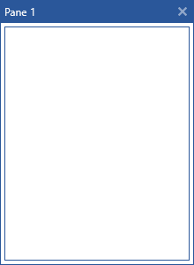

# Styling the ToolWindow

[ToolWindow]() is the container control that hosts all panes that are in a floating state. This article will demonstrate how to create a style targeting ToolWindow. 

## Targeting the ToolWindow Element

In order to style all __ToolWindows__ in a RadDocking, you should create a style targeting __ToolWindow__.

__Example 1: Creating an implicit style targeting ToolWindow__

```XAML
    <Application.Resources>
        <!-- If you are using the NoXaml binaries, you will have to base the style on the default one for the theme like so: 
        <Style TargetType="telerik:ToolWindow" BasedOn="{StaticResource ToolWindowStyle}">-->

        <Style TargetType="telerik:ToolWindow">
            <Setter Property="CanClose" Value="False" />
            <Setter Property="CornerRadius" Value="10" />
        </Style>
    </Application.Resources>

    <telerik:RadDocking>
        <telerik:RadSplitContainer InitialPosition="FloatingDockable">
            <telerik:RadPaneGroup >
                <telerik:RadPane Header="Pane 1"/>
            </telerik:RadPaneGroup>
        </telerik:RadSplitContainer>

        <telerik:RadSplitContainer >
            <telerik:RadPaneGroup >
                <telerik:RadPane Header="Pane 1"/>
            </telerik:RadPaneGroup>
        </telerik:RadSplitContainer>
    </telerik:RadDocking>
```

>important It is important for the implicit style targeting ToolWindow to be placed in the Application's Resources as shown in __Example 1__. This is due to the fact that the ToolWindows are in a separate visual tree from the MainWindow.

#### __Figure 1: ToolWindow with disabled close button in the Office2016 theme__


>tip In order to learn how to further modify the control by extracting its ControlTemplate, read the [Editing Control Templates]() article.

## See Also  
 * [Tool Window]()
 * [Drag and Drop]()
 * [Docked/Floating Panes]()
