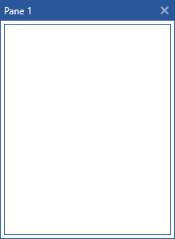

# Styling the ToolWindow

[ToolWindow]() is the container control that hosts all panes that are in a floating state. This article will demonstrate how to create a style targeting ToolWindow. 

## Targeting the ToolWindow Element

In order to style all __ToolWindows__ in a RadDocking, you should create a style targeting __ToolWindow__.

__Example 1: Creating an implicit style targeting ToolWindow__

<snippet id='raddocking-styles-and-templates-styling-the-toolwindow-example_1_creating_an_implicit_style_targeting_toolwindow-xaml' />

>important It is important for the implicit style targeting ToolWindow to be placed in the Application's Resources as shown in __Example 1__. This is due to the fact that the ToolWindows are in a separate visual tree from the MainWindow.

#### __Figure 1: ToolWindow with disabled close button in the Office2016 theme__

>tip In order to learn how to further modify the control by extracting its ControlTemplate, read the [Editing Control Templates]() article.

## See Also  
 * [Tool Window]()
 * [Drag and Drop]()
 * [Docked/Floating Panes]()
