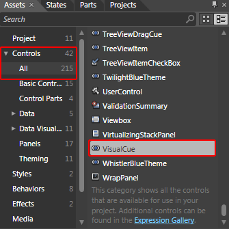
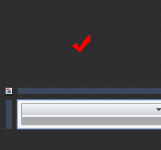
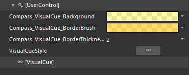
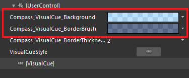
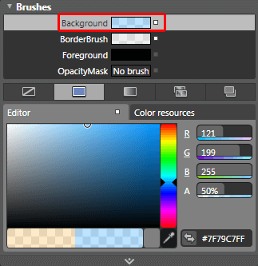
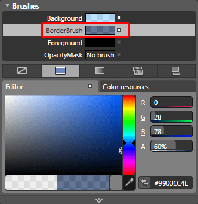
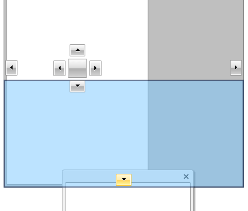

# Styling the Visual Cue

## 

The dropping area that you see, when rearranging the containers in the __RadDocking__ control, is represented by the __VisualCue__ control. Therefore you can't directly create a style for it in Expression Blend and you have to use a dummy control to create the style.

Open your __RadDocking__project in Expression Blend and select the __RadDocking__you want to modify. On the same scene you should place a __VisualCue__ control, that will be used as a dummy. To do so choose the Assets tab. From the 'Controls -> All' section select the __VisualCue__ control:

         
      

With your mouse create a new instance of the control on the scene:

         
      

>After drawing the __VisualCue__, you won't be able to see it on the scene.

Now select the newly created control. Then select Object -> *Edit Style -> Edit a Copy. *You will be prompted for the name of the style and where to be placed within your application.

>tipIf you choose to define the style in Application, it would be available for the entire application. This allows you to define a style only once and then reuse it where needed.

After clicking OK, a style for your __VisualCue__ control will be created and the properties that can be set through it will be loaded in the 'Properties' pane. 

Go to the 'Resources' pane and see the resources generated for your style. 

         
      

* __Compass_VisualCue_Background__ - is a brush representing the controls's background color.

* __Compass_VisualCue_BorderBrush__ - is the border brush used by the control.

* __Compass_VisualCue_BorderThickness__ - is the thickness of the border brush used by the control.

* __VisualCueStyle__ - represents the control's style. 

Here is an example of the above resources modified:

         
      

Select the __Background__ property and change its value. This will change the color of the __VisualCue__.

         
      

Select the __BorderBrush__ property and change its value. This will change the color of the border of the __VisualCue__.

         
      

After finishing with your modifications, remove the dummy control and set the style to the __RadDocking__'s __VisualCueStyle__ property.

#### __XAML__

{{region raddocking-styling-the-visual-cue_0}}
	<telerik:RadDocking x:Name="radDocking"
	                         VisualCueStyle="{StaticResource VisualCueStyle}">
	    ...
	</telerik:RadDocking>
	{{endregion}}

Here is a snapshot of the final result.

         
      

# See Also

 * [Styling and Appearance - Overview]()

 * [Compass]()

 * [Drag and Drop]()

 * [Styling the Compass]()

 * [Styling the RootCompass]()
