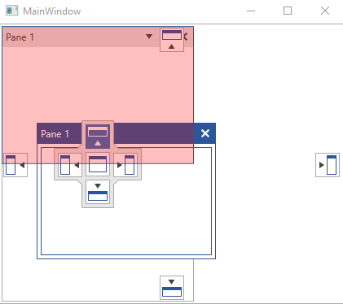

# Styling the Visual Cue

The dropping area that you see, when rearranging the containers in the __RadDocking__ control, is represented by the __VisualCue__ control.  

## Targeting the VisualCue Element

In order to style all __VisualCues__ in a RadDocking, you should create a style targeting __VisualCue__.

__Example 1: Creating a style targeting VisualCue__

```XAML
    <Application.Resources>
        <!-- If you are using the NoXaml binaries, you will have to base the style on the default one for the theme like so: 
            <Style x:Key="CustomVisualCueStyle" TargetType="telerik:VisualCue" BasedOn="{StaticResource VisualCueStyle}">-->

        <Style x:Key="CustomVisualCueStyle" TargetType="telerik:VisualCue">
            <Setter Property="Background" Value="Red" />
        </Style>
    </Application.Resources>

    <telerik:RadDocking VisualCueStyle="{StaticResource CustomVisualCueStyle}">
		<telerik:RadSplitContainer InitialPosition="FloatingDockable">
			<telerik:RadPaneGroup >
				<telerik:RadPane Header="Pane 1"/>
			</telerik:RadPaneGroup>
		</telerik:RadSplitContainer>

		<telerik:RadSplitContainer >
			<telerik:RadPaneGroup >
				<telerik:RadPane Header="Pane 1"/>
			</telerik:RadPaneGroup>
		</telerik:RadSplitContainer>
	</telerik:RadDocking>
```

#### __Figure 1: RadDocking with styled VisualCue in the Office2016 theme__


>tip In order to learn how to further modify the control by extracting its ControlTemplate, read the [Editing Control Templates]() article.

## See Also  
 * [Compass]()
 * [Drag and Drop]()
 * [Styling the Compass]()
 * [Styling the RootCompass]()