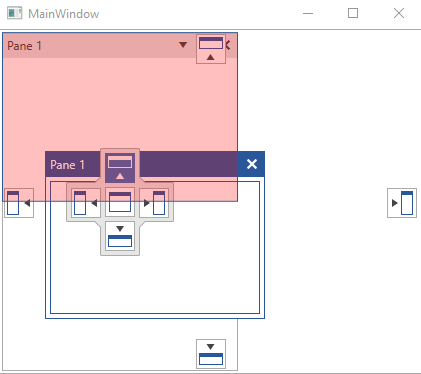

# Styling the Visual Cue

The dropping area that you see, when rearranging the containers in the __RadDocking__ control, is represented by the __VisualCue__ control.  

## Targeting the VisualCue Element

In order to style all __VisualCues__ in a RadDocking, you should create a style targeting __VisualCue__.

__Example 1: Creating a style targeting VisualCue__

<snippet id='raddocking-styles-and-templates-styling-the-visual-cue-example_1_creating_a_style_targeting_visualcue-xaml' />

#### __Figure 1: RadDocking with styled VisualCue in the Office2016 theme__

>tip In order to learn how to further modify the control by extracting its ControlTemplate, read the [Editing Control Templates]() article.

## See Also  
 * [Compass]()
 * [Drag and Drop]()
 * [Styling the Compass]()
 * [Styling the RootCompass]()