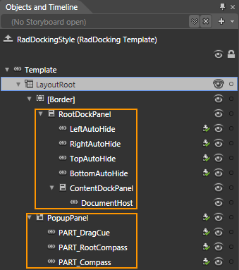
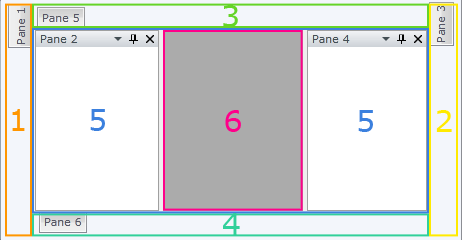
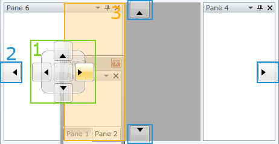

# Templates Structure

## 

This topic will explain you the structure of the __RadDocking__ template and describe the elements in it.

Except the standard layout controls like __Grid__and __Border__, the template contains two specific controls - RootDockPanel of type __RadDockPanel__and PopupPanel of type __Canvas__. They handle all of the functionality around the docking.

         
      

Take a look at the child elements of the __RootDockPanel__:

1. __LeftAutoHide__ - represents the auto hide area for the left part of the __RadDocking__ control.

1. __RightAutoHide__ - represents the auto hide area for the right part of the __RadDocking__ control.

1. __TopAutoHide__ - represents the auto hide area for the top part of the __RadDocking__ control.

1. __BottomAutoHide__ - represents the auto hide area for the bottom part of the __RadDocking__ control.

1. __ContentDockPanel__ - hosts the content of the __RadDocking__ control (such as [RadSplitContainers](), [RadPaneGroups]() etc.)

1. __DocumentHost__- represents the central content area of the __RadDocking__ control. [Read more here.]()

         
      

Take a look at the child elements of the __PopupPanel__:

1. __PART_Compass__ - represents the docking compass for the particular __RadDocking__ element. [Read more here](#Compass).

1. __PART_RootCompass__ - represents the docking compass for the whole __RadDocking__element. [Read more here](#Root_Compass).

1. __PART_DragCue__ - represents the __Visual Cue__when you drag elements to the docking areas. [Read more here]().

         
      

# See Also

 * [Overview]()

 * [Templating the RadDocking]()

 * [Visual Structure]()
