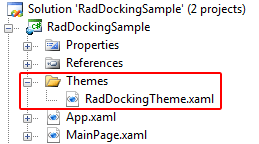

# Overview

>tipThis topic will present you with the simple way of creating a theme. It's suitable for themes which contain less XAML. The advanced approach is more performant, especially when creating themes for the larger controls. To learn more about the advanced approach read the [Creating a Custom Theme]() topic in the common section.

The __RadDocking__ uses controls such as __PaneHeader__, [RadPaneGroup](), [ToolWindow](), [RadSplitContainer]() that are usually created dynamically depending on the user's actions. Such controls cannot be styled declaratively in XAML. In order to style them you have to apply a theme to your __RadDocking__ control that contains the styles for them. 

>By applying a theme, the style for a particular control will be set to all of the controls of this type.

## Creating the Theme

Before theming the controls involved with the __RadDocking__ control, you have to create a __ResourceDictionary__ that will represent your theme. For example, create the following structure in your project.



In the __RadDockingTheme.xaml__ you will place the styles and the resources for your theme.

Before theming the controls involved with the __RadDocking__ control, you have to create a Class Library project that will represent your theme. For example create a project with the following name.



In the __Generic.xaml__ you should place the styles and the resources for your theme.

>The __RadDockingTheme__ class should inherit from the Telerik.Windows.Controls.__Theme__ class.

## Applying a Theme

The theme can be easily set to your __RadDocking__ control in the following way.

#### __C#__

{{region cs-raddocking-theming-overview_0}}
	public StylingPaneHeader()
	{
	    InitializeComponent();
	    StyleManager.SetTheme( this.radDocking, new Theme( new Uri( "/RadDockingSample;component/Themes/RadDockingTheme.xaml", UriKind.Relative ) ) );
	}
{{endregion}}

#### __VB.NET__

{{region vb-raddocking-theming-overview_1}}
	Public Sub New()
	    InitializeComponent()
	    StyleManager.SetTheme(Me.radDocking, New Theme(New Uri("/RadDockingSample;component/Themes/RadDockingTheme.xaml", UriKind.Relative)))
	End Sub
{{endregion}}

#### __XAML__

{{region xaml-raddocking-theming-overview_2}}
	<UserControl.Resources>
	    <CustomThemes:CustomTheme x:Key="MyTheme" />
	<UserControl.Resources>
	    ...
	<telerik:RadDocking x:Name="radDocking"
	                        telerik:StyleManager.Theme="{StaticResource MyTheme}">
{{endregion}}

#### __C#__

{{region cs-raddocking-theming-overview_3}}
	public StylingPaneHeader()
	{
	    InitializeComponent();
	    StyleManager.SetTheme( this.radDocking, new RadDockingTheme() );
	}
{{endregion}}

#### __VB.NET__

{{region vb-raddocking-theming-overview_4}}
	Public Sub New()
	    InitializeComponent()
	    StyleManager.SetTheme(Me.radDocking, New RadDockingTheme())
	End Sub
{{endregion}}

To learn more about theming controls read the common theming topics on this matter. If you are new to the controls they will give you a basic knowledge about it.

Read the following topics to learn:

* [Theming the Pane Header]()

* [Theming the RadPaneGroup]()

* [Theming the ToolWindow]()

* [Theming the RadSplitContainer]()

# See Also

 * [Styling and Appearance - Overview] () 
 * [Templating - Overview](0C09120C-CEAB-47B0-889F-D414965473E6)
