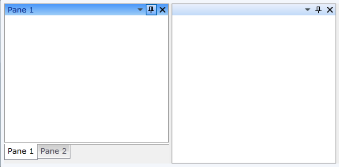

# Theming the Pane Header

To modify the appearance of the __PaneHeader__ you have to create a custom theme and place a style that targets the __PaneHeader__ control in it. The topic assumes that you have already created a theme with a __ResourceDictionary__ that will host the styles and the resources for your custom theme. If not take a look at the overview section about [creating the theme](#creating-the-theme). The topic also assumes that you have already created the style that will be used for the __PaneHeader__ control. To learn how to style it take a look at the [Styling the Pane Header]() topic.

Copy the created style with all of the resources it uses and place it in the __ResourceDictionary__ that represents the theme for your __RadDocking__ control.

<snippet id='raddocking-theming-pane-header-block_1-xaml' />

The next step is to declare the required namespaces in the __ResourceDictionary__.

<snippet id='raddocking-theming-pane-header-block_2-xaml' />



Finally in order to make the style default for all of the __PaneHeader__ controls you have to leave it without a key. Remove the key from the style.

<snippet id='raddocking-theming-pane-header-block_3-xaml' />

<snippet id='raddocking-theming-pane-header-block_4-cs' />

<snippet id='raddocking-theming-pane-header-block_4-vb' />

Finally in order to make the style default for all of the __PaneHeader__ controls you have to set it to the following value.

<snippet id='raddocking-theming-pane-header-block_5-xaml' />

Here is a snapshot of a sample result.

## See Also

 * [Theming - Overview]()

 * [Styling the Pane Header]()

 * [How to Add Icon to the RadPane's Header]()

 * [How to Add Buttons to the Pane Header]()
