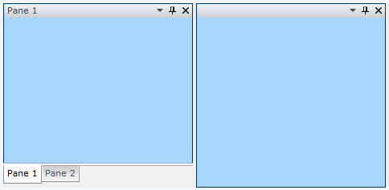

# Theming the RadPaneGroup

To modify the appearance of the __RadPaneGroup__ you have to create a custom theme and place a style that targets the __RadPaneGroup__ control in it. The topic assumes that you have created a theme witha __ResourceDictionary__ that will host the styles and the resources for your custom theme. To learn how to style it read the [Styling the RadPaneGroup]() topic.

Copy the created style with all of the resources it uses and place it in the __ResourceDictionary__ that represents the theme for your __RadDocking__ control.

<snippet id='raddocking-theming-radpane-group-block_1-xaml' />

The next step is to declare the required namespaces in the resource dictionary.

<snippet id='raddocking-theming-radpane-group-block_2-xaml' />

<snippet id='raddocking-theming-radpane-group-block_3-xaml' />

<snippet id='raddocking-theming-radpane-group-block_4-cs' />

<snippet id='raddocking-theming-radpane-group-block_4-vb' />

Finally in order to make the style default for all of the __RadPaneGroup__ controls you have to set it to the following value.

<snippet id='raddocking-theming-radpane-group-block_5-xaml' />

## See Also

 * [Styling the RadPaneGroup]()

 * [Pane Groups]()
