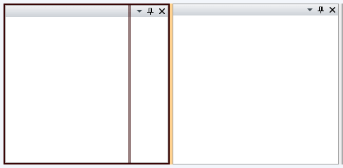

# Theming the RadSplitContainer

To modify the appearance of the __RadSplitContainer__ you have to create a custom theme and place a style that targets the __RadSplitContainer__ control in it. The topic assumes that you have already created a theme with a __ResourceDictionary__ that will host the styles and the resources for your custom theme. To learn how to style it take a look at the [Styling the RadSplitContainer]() topic.

Copy the created style with all of the resources it uses and place it in the __ResourceDictionary__ that represents the theme for your __RadDocking__ control.

<snippet id='raddocking-theming-radsplitcontainer-block_1-xaml' />

The next step is to declare the required namespaces in the resource dictionary.

<snippet id='raddocking-theming-radsplitcontainer-block_2-xaml' />

<snippet id='raddocking-theming-radsplitcontainer-block_3-xaml' />

<snippet id='raddocking-theming-radsplitcontainer-block_4-cs' />

<snippet id='raddocking-theming-radsplitcontainer-block_4-vb' />

Finally in order to make the style default for all of the __RadSplitContainer__controls you have to set it to the following value.

<snippet id='raddocking-theming-radsplitcontainer-block_5-xaml' />

## See Also

 * [Styling the RadSplitContainer]()
 * [Split Container]()
