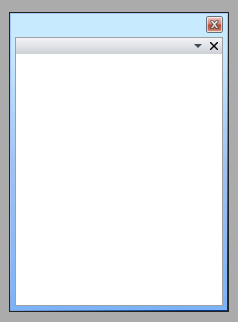

# Theming the ToolWindow

To modify the appearance of the ToolWindow you __have__ to create a custom theme and place a style that targets the __ToolWindow__ control in it. The topic assumes that you have already created a theme witha __ResourceDictionary__ that will host the styles and the resources for your custom theme. If not take a look at the overview section about [creating the theme](#CreatingTheme). The topic also assumes that you have created the style that will be used for the __ToolWindow__ control. To learn how to style it take a look at the [Styling the ToolWindow]() topic.

Copy the created style with all of the resources it uses and place it in the __ResourceDictionary__ that represents the theme for your __RadDocking__ control.

```XAML
	<ResourceDictionary xmlns="http://schemas.microsoft.com/winfx/2006/xaml/presentation"
	    xmlns:x="http://schemas.microsoft.com/winfx/2006/xaml">
	    <!--Paste the style and all of the resources it uses here. -->
	    <Style x:Key="ToolWindowStyle" TargetType="telerik:ToolWindow">
	        <!--...-->
	    </Style>
	</ResourceDictionary>
```

The next step is to declare the required namespaces in the resource dictionary.

```XAML
	<ResourceDictionary xmlns="http://schemas.microsoft.com/winfx/2006/xaml/presentation"
	    xmlns:x="http://schemas.microsoft.com/winfx/2006/xaml"
	    xmlns:telerik="http://schemas.telerik.com/2008/xaml/presentation">
	    <!--...-->
	</ResourceDictionary>
```

```XAML
	<Style TargetType="telerik:ToolWindow">
	    <!--...-->
	</Style>
```

```C#
	public App()
	{
	    InitializeComponent();
	    StyleManager.SetTheme( this.radDocking, new RadDockingTheme());
	}
```
```VB.NET
	Public Sub New()
		InitializeComponent()
		StyleManager.SetTheme(Me.radDocking, New Theme())
	End Sub
```

Finally in order to make the style default for all of the __ToolWindow__ controls you have to set it to the following value.

```XAML
	<Style x:Key="{telerik:ThemeResourceKey ThemeType={x:Type local:RadDockingTheme}, ElementType={x:Type telerik:ToolWindow}}"
	TargetType="{x:Type telerik:ToolWindow}">
	    <!--...-->
	</Style>
```



## See Also

 * [Theming - Overview]()

 * [Styling the ToolWindow]()

 * [Tool Window]()

 * [Docked/Floating Panes]()
