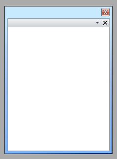

# Theming the ToolWindow

To modify the appearance of the ToolWindow you __have__ to create a custom theme and place a style that targets the __ToolWindow__ control in it. The topic assumes that you have already created a theme witha __ResourceDictionary__ that will host the styles and the resources for your custom theme. To learn how to style it take a look at the [Styling the ToolWindow]() topic.

Copy the created style with all of the resources it uses and place it in the __ResourceDictionary__ that represents the theme for your __RadDocking__ control.

<snippet id='raddocking-theming-toolwindow-block_1-xaml' />

The next step is to declare the required namespaces in the resource dictionary.

<snippet id='raddocking-theming-toolwindow-block_2-xaml' />

<snippet id='raddocking-theming-toolwindow-block_3-xaml' />

<snippet id='raddocking-theming-toolwindow-block_4-cs' />

<snippet id='raddocking-theming-toolwindow-block_4-vb' />

Finally in order to make the style default for all of the __ToolWindow__ controls you have to set it to the following value.

<snippet id='raddocking-theming-toolwindow-block_5-xaml' />

## See Also

 * [Theming - Overview]()

 * [Styling the ToolWindow]()

 * [Tool Window]()

 * [Docked/Floating Panes]()
