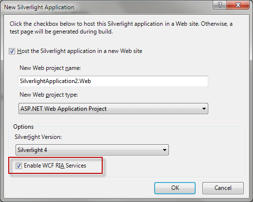
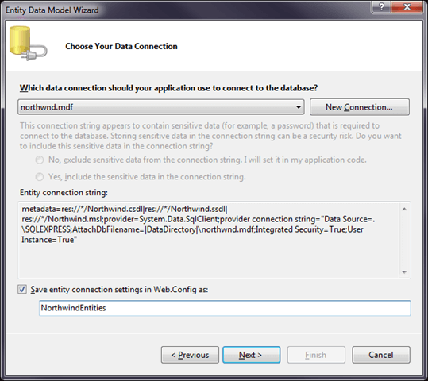
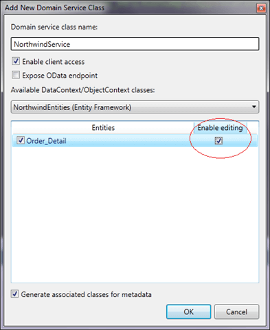

# CRUD operations

## 

This topic shows how to create simple __CRUD__ (___Create, Read, Update___ and ___Delete___) application with __RadDomainDataSource__ and __RadGridView__. For more information on how to load data initially please read [here]().

1. Create a default Silverlight project as following:
 

2. Create __ADO.NET Entity__ data model called __Northwind.edmx__. For the sake of the example let's create this entity model with the __Northwnd.mdf__ file. You will need a working (started) __SQL Server EXPRESS__ service on your machine (or you have to change connection string accordingly).
 

> Do not forget to rebuild web project on this stage. 

3. Create __DomainService__ class with enabled editing:

4. Then on the client application place __RadGridView__ control with some buttons nearby. 
Here is the xaml code for a reference on how to create binding to __SubmitChanges__ and __RejectChanges__ commands:

#### __XAML__

{{region domaindatasource-crud_0}}

	<Grid x:Name="LayoutRoot" Background="White">
	    <Grid.RowDefinitions>
	        <RowDefinition Height="Auto" />
	        <RowDefinition Height="*" />
	    </Grid.RowDefinitions>
	    <telerik:RadDomainDataSource x:Name="radDomainDataSource" AutoLoad="True" QueryName="GetOrder_Details">
	        <telerik:RadDomainDataSource.DomainContext>
	            <web:NorthwindContext />
	        </telerik:RadDomainDataSource.DomainContext>
	    </telerik:RadDomainDataSource>
	    <StackPanel Grid.Row="0">
	        <telerik:RadButton x:Name="submitChangesButton" Content="Submit Changes" 
	                           Command="{Binding SubmitChangesCommand, ElementName=radDomainDataSource}" 
	                           CommandTarget="{Binding ElementName=radDomainDataSource}"/>
	        <telerik:RadButton x:Name="rejectChangesButton" Content="Reject Changes" 
	                           Command="{Binding RejectChangesCommand, ElementName=radDomainDataSource}" 
	                           CommandTarget="{Binding ElementName=radDomainDataSource}"/>
	    </StackPanel>
	            <telerik:RadGridView x:Name="radGridView" Grid.Row="1" 
	                         ItemsSource="{Binding DataView, ElementName=radDomainDataSource}" 
	                         IsBusy="{Binding IsBusy, ElementName=radDomainDataSource}" 
	                         ShowInsertRow="True" />
	</Grid>
{{endregion}}

How to use the example:

1. __Create__ - You could add new item via Insert key or with __RadGridView’s__ add new item UI (_“Click here to add new item”_). 

1. __Update__ - Put any cell into edit mode, change its value and commit row edit via _Enter_ or click on another row. (note that __ProductID__ field is read-only). 

1. __Delete__ - Just select an item and press _Delete_ key. 

As you will notice both buttons ___“Submit Changes”___ and ___“Reject Changes”___ will be enabled when any of these operations is finished (after Row edit is finished).

> Changes will be populated on a server when __Submit Changes__ button is clicked.

>A working solution can be downloaded from [here](http://blogs.telerik.com/blogs/posts/10-12-28/creating-crud-application-with-raddomaindatasource-for-silverlight.aspx).

