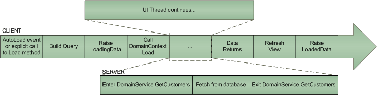

# Loading Data

Let's start with the data load lifecycle:

## Triggering a Load

A load operation can be triggered in two ways. You can either call the __Load__ method explicitly or you can rely on the __AutoLoad__ functionality, which is explained below.

## Building The Query

After a load has been requested a query based on user input is constructed on the client. This query tells the server things such as “Give me the first page of (this is the paging) all sales employees (filtering) ordered by their sick leave hours (sorting). RadDomainDataSource will build this query based on its __FilterDescriptors__, __SortDescriptors__, __PageSize__ and __PageIndex__. 

If you have a Telerik control such as [RadGridView](http://demos.telerik.com/silverlight/#GridView/FirstLook), [RadDataFilter](http://demos.telerik.com/silverlight/#DataFilter/FirstLook), or [RadDataPager](http://demos.telerik.com/silverlight/#DataPager/FirstLook) that is bound to __RadDomainDataSource__ then you don’t have to do anything since the descriptors and paging of __RadDomainDataSource__ will be automatically updated. For example, when the user sorts __RadGridView__, __RadGridView__ will _“talk”_ to __RadDomainDataSource__ and add a __SortDescriptor__ to it. In fact, when two Telerik data controls detect each other they start synchronizing their descriptors automatically. They recognize each other thanks to the __IQueryableCollectionView__ interface. You can use __RadDomainDataSource__ with any other control, but it would then be your responsibility to maintain its descriptors.

To be completely correct, it is not __RadDomainDataSource__ that builds the query, but its inner view - the __QueryableDomainServiceCollectionView__, which we will call __QDSCV__ from now on. Since __RadDomainDataSource__ is just a XAML-friendly thin wrapper over the __QDSCV__ it simply delegates all the work to the view.

The query that is sent to server is of type [EntityQuery](http://msdn.microsoft.com/en-us/library/system.servicemodel.domainservices.client.entityquery%28v=vs.91%29.aspx). MSDN tells us that this class represents a query method invocation. In your client application, you can apply additional filtering on a query to limit which entities are returned. You use LINQ and a subset of LINQ query operators to modify the results returned from the query. The following lists the available query operators:

* __Where__ 

* __OrderBy__

* __ThenBy__ 

* __Skip__ 

* __Take__ 

After you apply additional filtering, you pass the __EntityQuery__ object as a parameter in the [Load](http://msdn.microsoft.com/en-us/library/system.servicemodel.domainservices.client.domaincontext.load%28v=vs.91%29.aspx) method of the [DomainContext](http://msdn.microsoft.com/en-us/library/ee707370%28v=vs.91%29.aspx) to execute the query and get the results.

That is exactly what the __QDSCV__ does. It takes the original entity query, does some [LINQ Expression](http://msdn.microsoft.com/en-us/library/system.linq.expressions.expression.aspx) magic to append the sorting, filtering, and paging information, and then calls the Load method of its __DomainContext__.

If you are doing __MVVM__ and you are working directly with the __QDSCV__ (i.e. you don’t have a __RadDomainDataSource__ control), you will notice that the constructor of this class requires two things:

#### __C#__

{{region domaindatasource-loading-data_0}}

	public QueryableDomainServiceCollectionView(DomainContext domainContext, EntityQuery<TEntity> entityQuery)
	     : base(domainContext, new DomainServiceCollection<TEntity>(domainContext))
{{endregion}}

The __DomainContext__ is automatically generated for you by Visual Studio each time you build the server-side project. If the [DomainService](http://msdn.microsoft.com/en-us/library/ee707373%28v=vs.91%29.aspx) has a method called __GetCustomers__, then your __DomainContext__ will have a method called __GetCustomersQuery__ with the following signature:

#### __C#__

{{region domaindatasource-loading-data_1}}

	public EntityQuery<Customer> GetCustomersQuery()
	{
	     this.ValidateMethod("GetCustomersQuery", null);
	     return base.CreateQuery<Customer>("GetCustomers", null, false, true);
	}
{{endregion}}

So you can instantiate a new __QDSCV__ like this:

#### __C#__

{{region domaindatasource-loading-data_2}}

	NorthwindDomainContext context = new NorthwindDomainContext();
	EntityQuery<Customer> query = context.GetCustomersQuery();
	QueryableDomainServiceCollectionView<Customer> view = new QueryableDomainServiceCollectionView<Customer>(context, query);
{{endregion}}

When you are using the __RadDomainDataSource__ control, you only need to specify the domain context and the name of the query as a string.

#### __XAML__

{{region domaindatasource-loading-data_3}}

	<telerik:RadDomainDataSource
	   x:Name="customersDataSource"
	   QueryName="GetCustomers" PageSize="10"
	   LoadingData="OnCustomersDataSourceLoadingData"
	   LoadedData="OnCustomersDataSourceLoadedData">
	   <telerik:RadDomainDataSource.DomainContext>
	       <e:NorthwindDomainContext />
	   </telerik:RadDomainDataSource.DomainContext>
	</telerik:RadDomainDataSource>
{{endregion}}

The control will then find the appropriate method on the __DomainContext__ by using reflection. After that it will instantiate its inner __QDSCV__ in the same manner.

## Waiting for Data 

Once the query has been prepared by the __QDSCV__, it is time to call the Load method of the __DomainContext__. Before doing that however, the __LoadingData__ event is fired. In the event handler you have a last chance to modify the EntityQuery by hand, change the [LoadBehavior](http://msdn.microsoft.com/en-us/library/system.servicemodel.domainservices.client.loadbehavior%28v=vs.91%29.aspx) or cancel the whole operation altogether. If you don’t cancel the load, you exit the event handler and execution transfers to the UI thread. This is where we start waiting for the server to send some data back.

The UI thread will not block and will continue executing normally since loading data is an asynchronous process. Several properties of __RadDomainDataSource__ (__QDSCV__ respectively) will change to indicate that something is going on. The __IsLoadingData__ property will evaluate to true while we are waiting for the server to return the data. Same applies for the __IsBusy__ property. You might wonder why we have both of them. __IsLoadingData__ is ___true___ while we are loading data, whereas __IsBusy__ is ___true___ while we are __either__ loading data __or__ submitting changes. As you might have already guessed, there is a third property called __IsSubmittingData__. The __IsBusy__ property is perfect for busy indicator binding:

#### __XAML__

{{region domaindatasource-loading-data_4}}

	<telerik:RadBusyIndicator IsBusy="{Binding IsBusy, ElementName=customersDataSource}">
{{endregion}}

## Cancelling the Request

While you are waiting for data to return you can always call the __CancelLoad__ method or execute the __CancelLoadCommand.__This will cancel the current load request. In order to test this functionality, you might want to increase the fake server delay I have placed in __NorthwindDomainService__:

#### __C#__

{{region domaindatasource-loading-data_5}}

	public IQueryable<Customer> GetCustomers()
	{
	   // Fake server slow-down.
	   Thread.Sleep(500);
	   return this.ObjectContext.Customers.OrderBy(c=>c.CustomerID);
	}
{{endregion}}

## Receiving Data

Once the server returns the data, the __QDSCV__ will detect this and update itself with the new entities. You don’t have to do anything special here. If you have bound your [ItemsControl](http://msdn.microsoft.com/en-us/library/system.windows.controls.itemscontrol%28v=VS.95%29.aspx) (for example __RadGridView__) to a __QDSCV__ or __RadDomainDataSource.DataView__ it will be automatically refreshed. This is the moment when the __LoadedData__ event will be fired. If there was some kind of server error it will be stored in the event arguments so you can take the appropriate action.

## AutoLoad

__RadDomainDataSource__ has a property called __AutoLoad__. If AutoLoad is true, a load request is made each time something that affects the query changes. The changes that will trigger an auto-load include changes in the __FilterDescriptors__, __SortDescriptors__, __GroupDescriptors__, and __QueryParameters__. Furthermore, data is automatically reloaded when the __PageIndex__ or __PageSize__ change. Changing the page index will __always__ load the new page of data regardless of the __AutoLoad__ setting.

When __AutoLoad__ is false, it is your responsibility to request a load, for example on a button click. This can be done either through the __Load__ method or by using the __LoadCommand__if you are a __MVVM__ person. Additionally, there is a property called __LoadDelay__which determines the delay between the time a change that prompts an automatic load occurs and the time the subsequent __Load__ [Link...](http://msdn.microsoft.com/en-us/library/system.windows.controls.domaindatasource.load%28v=VS.91%29.aspx) is invoked.

