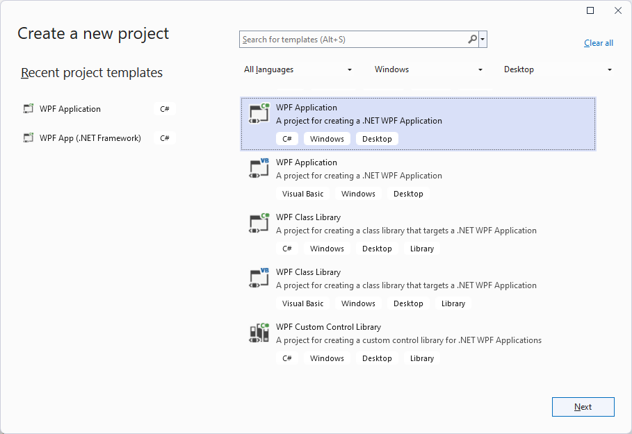
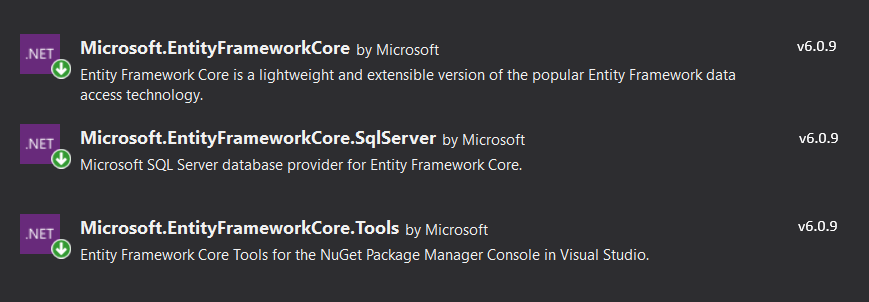

# Getting Started with {{ site.framework_name }} EntityFrameworkCoreDataSource

This article shows how to create a sample .NET application using __RadEntityFrameworkCoreDataSource__ and __RadGridView__.

> __RadEntityFrameworkCoreDataSource__ is built on top of [Entity Framework Core](https://docs.microsoft.com/en-us/ef/core/). It is recommended to familiarize yourself with the framework before going over this tutorial.

## Creating the WPF .NET Application

Start Visual Studio 2019 (or newer), select "Create a new project" and choose WPF App (.NET Core).

#### __Figure 1: WPF .NET Application__

## Adding Telerik Assemblies Using NuGet

To use __RadEntityFrameworkCoreDataSource__ when working with NuGet packages, install the `Telerik.Windows.Controls.EntityFrameworkCore.for.Wpf.Xaml` package. The [package name may vary]() slightly based on the Telerik dlls set - [Xaml or NoXaml]()

Read more about NuGet installation in the [Installing UI for WPF from NuGet Package]() article.

>tip With the 2025 Q1 release, the Telerik UI for WPF has a new licensing mechanism. You can learn more about it [here]().

## Adding Assembly References Manually

If you are not using NuGet packages, you can add a reference to the following assemblies:

* __Microsoft.EntityFrameworkCore__
* __Microsoft.EntityFrameworkCore.SqlServer__
* __Microsoft.EntityFrameworkCore.Tools__

	The required __Microsoft.EntityFrameworkCore__ version varies based on the target .NET version of the Telerik dlls.
		
	* __.NET 6__&mdash;EFCore version __6.0.9__
	* __.NET 7__&mdash;EFCore version __7.0.0__
	
	#### __Figure 2: NuGet Packages__
	
	
We will also add the needed Telerik references.

* __Telerik.Licensing.Runtime__
* __Telerik.Windows.Controls__
* __Telerik.Windows.Controls.Data__
* __Telerik.Windows.Controls.EntityFrameworkCore__
* __Telerik.Windows.Controls.GridView__
* __Telerik.Windows.Controls.Input__
* __Telerik.Windows.Data__

## Xaml Usage

__Example 1__ demonstrates how you can set up the RadEntityFrameworkCoreDataSource and display data in a RadGridView. It assumes that you already have a DbContext named "MyEntityModel", which contains a DbSet called "Customers". 

> In case you don't have a DbContext/database setup, you can check out the [MVVM Usage]() article, which shows how you can set them up from scratch.

#### __[XAML] Example 1: Defining RadEntityFrameworkCoreDataSource in xaml__
{{region xaml-entityframeworkcore-getting-started-0}}

    <telerik:RadEntityFrameworkCoreDataSource Name="EntityFrameworkCoreDataSource" QueryName="Customers"> 
        <telerik:RadEntityFrameworkCoreDataSource.DbContext> 
            <local:MyEntityModel/> 
        </telerik:RadEntityFrameworkCoreDataSource.DbContext> 
    </telerik:RadEntityFrameworkCoreDataSource> 
    <telerik:RadGridView ItemsSource="{Binding DataView, ElementName=EntityFrameworkCoreDataSource}"/>
{{endregion}}

## RelatedObjects

The __RelatedObjects__ property of the RadEntityFrameworkCoreDataSource allows you to specify the names of the related entities that need to be retrieved. For example, if your main entity set is called "Customers", you might want to retrieve the "Orders"  collection in case you want to get the related Orders for each Customer from the database. You can also specify several navigational property names separated by "/" characters and the control will use the ".ThenInclude()" method when retrieving them. 

#### __[XAML] Example 2: Using the RelatedObjects__
{{region xaml-entityframeworkcore-getting-started-1}}

    <telerik:RadEntityFrameworkCoreDataSource x:Name="coreDataSource" QueryName="Customers">
        <telerik:RadEntityFrameworkCoreDataSource.RelatedObjects>
            <sys:String>Orders/OrderDetails</sys:String>
        </telerik:RadEntityFrameworkCoreDataSource.RelatedObjects>
        <telerik:RadEntityFrameworkCoreDataSource.DbContext>
            <local:NorthwindContext />
        </telerik:RadEntityFrameworkCoreDataSource.DbContext>
    </telerik:RadEntityFrameworkCoreDataSource>
{{endregion}}

## See also

* [RadGridView]()


## Telerik UI for WPF Learning Resources

* [Telerik UI for WPF EntityFrameworkDataSource Component](https://www.telerik.com/products/wpf/entity-framework-data-source.aspx)
* [Getting Started with Telerik UI for WPF Components]()
* [Telerik UI for WPF Installation]()
* [Telerik UI for WPF and WinForms Integration]()
* [Telerik UI for WPF Visual Studio Templates]()
* [Setting a Theme with Telerik UI for WPF]()
* [Telerik UI for WPF Virtual Classroom (Training Courses for Registered Users)](https://learn.telerik.com/learn/course/external/view/elearning/16/telerik-ui-for-wpf) 
* [Telerik UI for WPF License Agreement](https://www.telerik.com/purchase/license-agreement/wpf-dlw-s)


