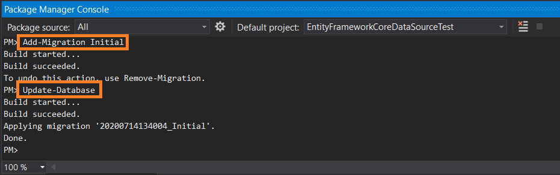
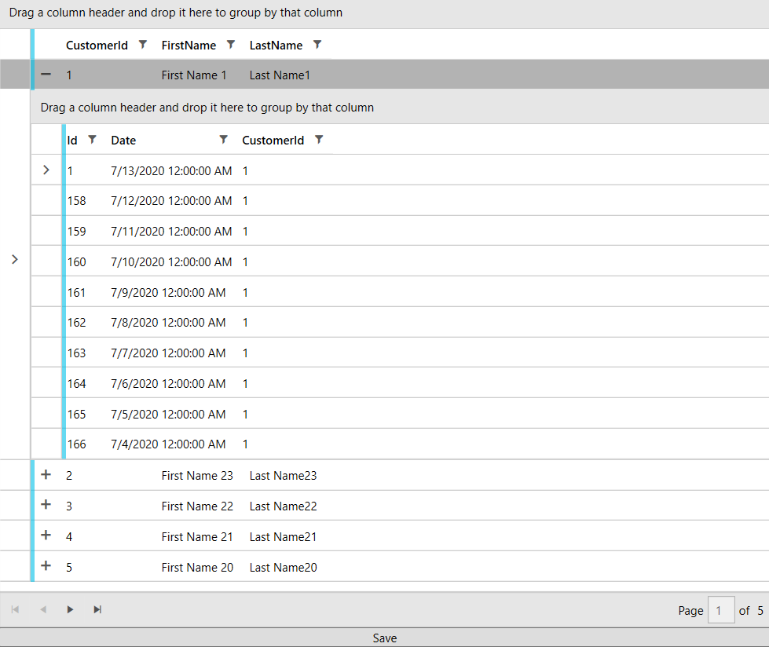

# MVVM Usage

This article shows how to create a database using the code first approach and display data with the help of RadEntityFrameworkCoreDataSource and RadGridView.

>important Before proceeding with this tutorial, you should follow the [Getting Started]() article. 

## Adding the Models and DbContext

We will create two classes, which will serve as our models: Customer and Order, where each customer will have a collection of orders. We will also define a DbContext and setup our connection string.  

__Example 1: Defining the Models and DbContext__
```C#

    public class Customer
    {
        [Key]
        [DatabaseGenerated(DatabaseGeneratedOption.Identity)]
        public int CustomerId { get; set; }
        public string FirstName { get; set; }
        public string LastName { get; set; }
        public virtual List<Order> Orders { get; set; }
    }

    public class Order
    {
        [Key]
        [DatabaseGenerated(DatabaseGeneratedOption.Identity)]
        public int Id { get; set; }
        public DateTime Date { get; set; }

        public int CustomerId { get; set; }

        [ForeignKey("CustomerId")]
        public virtual Customer Customer { get; set; }
    }

    public class MyContext : DbContext
    {
        protected override void OnConfiguring(DbContextOptionsBuilder optionsBuilder)
        {
            // You might need to update the connection string to suit the setup on your machine
            optionsBuilder.UseSqlServer(@"Data Source=.\SQLEXPRESS;Initial Catalog=CustomerDB;Integrated security=true");
        }

        public DbSet<Customer> Customers { get; set; }
        public DbSet<Order> Orders { get; set; }
    }
```

## Creating the Database

For this tutorial we are going to use the [code first](https://docs.microsoft.com/en-us/ef/core/get-started/?tabs=netcore-cli) approach for generating a database. In order to generate it, you can follow these steps:

1. Start [SQL Server Management Studio](https://docs.microsoft.com/en-us/sql/ssms/download-sql-server-management-studio-ssms?view=sql-server-ver15) and [connect](https://docs.microsoft.com/en-us/sql/ssms/tutorials/connect-query-sql-server?view=sql-server-ver15) to your localhost server.
2. Open the [Package Manager Console](https://docs.microsoft.com/en-us/nuget/consume-packages/install-use-packages-powershell) in the Visual Studio instance, where you created the WPF project. 
3. Execute the "Add-Migration Initial" command followed by the "Update-Database" command. After that you should have a "CustomerDB" database created, if you expand the Databases node in SQL Server Management Studio.

	#### __Figure 3: Package Manager Console Commands__
	

> Learn more about migrations in EF Core in the [following article](https://docs.microsoft.com/en-us/ef/core/managing-schemas/migrations/?tabs=dotnet-core-cli).

## Populating the Database

We will create a viewmodel that will populate our database and also hold an instance of a __QueryableEntityCoreCollectionView__ that will be the bridge between the RadGridView and our database. We will also introduce a command that will execute the __SaveChanges__ method of the DbContext on a button's click. 

__Example 2: Defining the viewmodel__
```C#

	public class ViewModel : ViewModelBase
    {
        private QueryableEntityCoreCollectionView<Customer> entityCollectionView;

        private MyContext context;

        public ViewModel()
        {
            this.context = new MyContext();
            this.SaveCommand = new DelegateCommand(Save);

            this.AddData(context);
            this.EntityCollectionView = new QueryableEntityCoreCollectionView<Customer>(context, context.Customers, new Collection<string>() { "Orders"});
        }

        public DelegateCommand SaveCommand { get; }

        public QueryableEntityCoreCollectionView<Customer> EntityCollectionView
        {
            get { return entityCollectionView; }
            set
            {
                this.entityCollectionView = value;
                this.OnPropertyChanged(() => this.EntityCollectionView);
            }
        }

        private void AddData(MyContext context)
        {
            for (int i = 1; i <= 25; i++)
            {
                var customer = new Customer() { FirstName = "First Name " + i, LastName = "Last Name" + i };

                for (int j = 1; j <= 10; j++)
                {
                    var order = new Order() { CustomerId = i, Customer = customer, Date = DateTime.Today.AddDays(-j)};
                    context.Orders.Add(order);
                }
                context.Customers.Add(customer);
            }

            context.SaveChanges();
        }

        public void Save(object obj)
        {
            this.context.SaveChanges();
        }
    }
```

## Displaying the Data

All that is left is to declare our xaml and wire up the viewmodel. We will display the data in a RadGridView with a [Row Details Template]() and use a [RadDataPager]() to add paging functionality. 

__Example 3: Seting up the xaml__
```XAML

	<Grid xmlns:local="clr-namespace:EntityFrameworkCoreDataSourceTest"
        xmlns:telerik="http://schemas.telerik.com/2008/xaml/presentation">
        <Grid.DataContext>
            <local:ViewModel />
        </Grid.DataContext>
        <Grid.RowDefinitions>
            <RowDefinition />
            <RowDefinition Height="Auto"/>
            <RowDefinition Height="Auto"/>
        </Grid.RowDefinitions>
        <telerik:RadGridView GroupRenderMode="Flat" ItemsSource="{Binding PagedSource, ElementName=pager}" AutoGenerateColumns="False">
            <telerik:RadGridView.Columns>
                <telerik:GridViewToggleRowDetailsColumn />
                <telerik:GridViewDataColumn DataMemberBinding="{Binding CustomerId}" />
                <telerik:GridViewDataColumn DataMemberBinding="{Binding FirstName}" />
                <telerik:GridViewDataColumn DataMemberBinding="{Binding LastName}" />
            </telerik:RadGridView.Columns>
            <telerik:RadGridView.RowDetailsTemplate>
                <DataTemplate>
                    <telerik:RadGridView GroupRenderMode="Flat"  ItemsSource="{Binding Orders}" AutoGenerateColumns="False">
                        <telerik:RadGridView.Columns>
                            <telerik:GridViewDataColumn DataMemberBinding="{Binding Id}" />
                            <telerik:GridViewDataColumn DataMemberBinding="{Binding Date}" />
                            <telerik:GridViewDataColumn DataMemberBinding="{Binding CustomerId}" />
                        </telerik:RadGridView.Columns>
                    </telerik:RadGridView>
                </DataTemplate>
            </telerik:RadGridView.RowDetailsTemplate>
        </telerik:RadGridView>
        <telerik:RadDataPager x:Name="pager" Source="{Binding EntityCollectionView}" PageSize="5"  Grid.Row="1" />
        <Button Content="Save" Grid.Row="2">
            <telerik:EventToCommandBehavior.EventBindings>
                <telerik:EventBinding EventName="Click" Command="{Binding SaveCommand}" />
            </telerik:EventToCommandBehavior.EventBindings>
        </Button>
    </Grid>
```

#### __Figure 4: Result from running the example in the Fluent theme__


## See also

* [Getting Started]()
* [RadGridView]()
