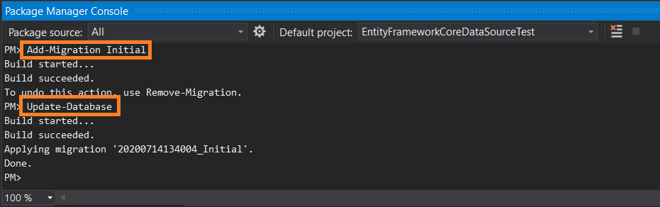
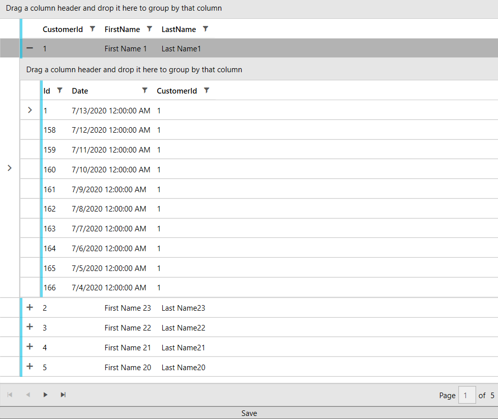

# MVVM Usage

This article shows how to create a database using the code first approach and display data with the help of RadEntityFrameworkCoreDataSource and RadGridView.

>important Before proceeding with this tutorial, you should follow the [Getting Started]() article. 

## Adding the Models and DbContext

We will create two classes, which will serve as our models: Customer and Order, where each customer will have a collection of orders. We will also define a DbContext and setup our connection string.  

__Example 1: Defining the Models and DbContext__
<snippet id='radentityframeworkcoredatasource-entityframeworkcore-mvvm-usage-example_1_defining_the_models_and_dbcontext-cs' />

## Creating the Database

For this tutorial we are going to use the [code first](https://docs.microsoft.com/en-us/ef/core/get-started/?tabs=netcore-cli) approach for generating a database. In order to generate it, you can follow these steps:

1. Start [SQL Server Management Studio](https://docs.microsoft.com/en-us/sql/ssms/download-sql-server-management-studio-ssms?view=sql-server-ver15) and [connect](https://docs.microsoft.com/en-us/sql/ssms/tutorials/connect-query-sql-server?view=sql-server-ver15) to your localhost server.
2. Open the [Package Manager Console](https://docs.microsoft.com/en-us/nuget/consume-packages/install-use-packages-powershell) in the Visual Studio instance, where you created the WPF project. 
3. Execute the "Add-Migration Initial" command followed by the "Update-Database" command. After that you should have a "CustomerDB" database created, if you expand the Databases node in SQL Server Management Studio.

	#### __Figure 3: Package Manager Console Commands__
	

> Learn more about migrations in EF Core in the [following article](https://docs.microsoft.com/en-us/ef/core/managing-schemas/migrations/?tabs=dotnet-core-cli).

## Populating the Database

We will create a viewmodel that will populate our database and also hold an instance of a __QueryableEntityCoreCollectionView__ that will be the bridge between the RadGridView and our database. We will also introduce a command that will execute the __SaveChanges__ method of the DbContext on a button's click. 

__Example 2: Defining the viewmodel__
<snippet id='radentityframeworkcoredatasource-entityframeworkcore-mvvm-usage-example_2_defining_the_viewmodel-cs' />

## Displaying the Data

All that is left is to declare our xaml and wire up the viewmodel. We will display the data in a RadGridView with a [Row Details Template]() and use a [RadDataPager]() to add paging functionality. 

__Example 3: Seting up the xaml__
<snippet id='radentityframeworkcoredatasource-entityframeworkcore-mvvm-usage-example_3_seting_up_the_xaml-xaml' />

#### __Figure 4: Result from running the example in the Fluent theme__

## See also

* [Getting Started]()
* [RadGridView]()
