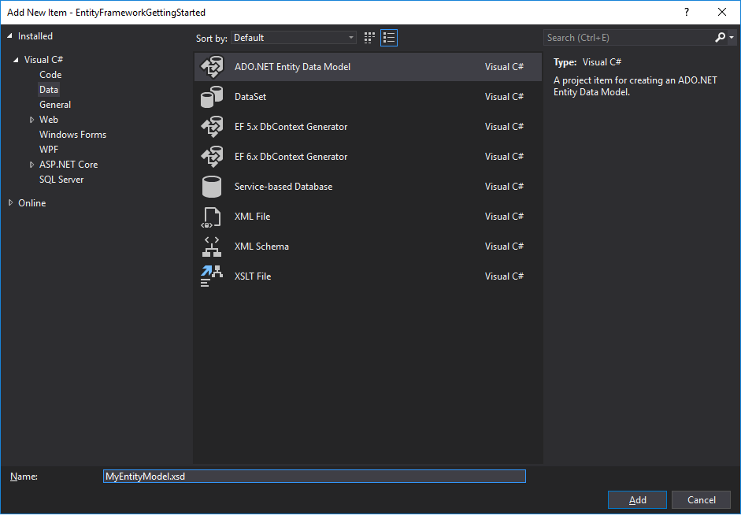
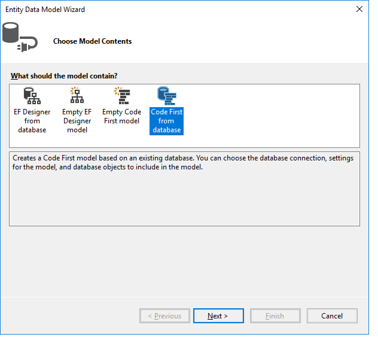

# Getting Started with WPF EntityFrameworkDataSource

This tutorial will walk you through the creation of a sample application that contains `RadGridView` bound to `RadEntityFrameworkDataSource`.

* [Creating the WPF Application](#creating-the-wpf-application)
* [Creating the Model](#creating-the-model)
* [Adding RadGridView and RadEntityFrameworkDataSource](#adding-radgridview-and-radentityframeworkdatasource)

>With the release of the __2025 Q4__, the __Telerik.Windows.Controls.EntityFramework__ assembly has been removed. Instead, you will need to reference the __Telerik.Windows.Controls.EntityFramework60__ assembly, which is built against the __EntityFramework__ NuGet package with version __6.5.1__.

## Adding Telerik Assemblies Using NuGet

To use RadEntityFrameworkDataSource when working with NuGet packages, install the `Telerik.Windows.Controls.EntityFramework.for.Wpf.Xaml` package. The [package name may vary]() slightly based on the Telerik dlls set - [Xaml or NoXaml]()

Read more about NuGet installation in the [Installing UI for WPF from NuGet Package]() article.

>tip With the 2025 Q1 release, the Telerik UI for WPF has a new licensing mechanism. You can learn more about it [here]().

## Creating the WPF Application

1. Note that RadEntityFrameworkDataSource is built on top of the [ADO.NET Entity Framework](https://docs.microsoft.com/en-us/ef/ef6/). Basic Entity Framework experience is required for working with RadEntityFrameworkDataSource.

2. Start Visual Studio and create a new WPF Application.

## Creating the Model

Now that we have the application, we will add our entity model using the AdventureWorks database. 

1. In the project add a new __ADO.NET Entity Data Model__. You need to make sure that __Data__ is selected from the left menu.


2. Choose to create a model using the code first approach from an existing database.


3. Choose the data connection (for example the __AdventureWorks__ database). In order to learn how to add the AdventureWorks database, check out the [AdventureWorks Readme](https://github.com/Microsoft/sql-server-samples/tree/master/samples/databases/adventure-works) article.

4. Generate the entities from all of the tables in the AdventureWorks database.

5. Click __Finish__ and __rebuild the solution__.

## Adding RadGridView and RadEntityFrameworkDataSource

Now let's go to the client side.

**1.** Add References to the following Telerik assemblies:

* __Telerik.Licensing.Runtime__
* __Telerik.Windows.Controls__ (mandatory for both RadGridView and RadEntityFrameworkDataSource)
* __Telerik.Windows.Controls.EntityFramework60__ (mandatory for RadEntityFrameworkDataSource with EF __6.0__ or later)
* __Telerik.Windows.Controls.GridView__ (mandatory for RadGridView)
* __Telerik.Windows.Controls.Input__ (mandatory for RadGridView)
* __Telerik.Windows.Data__ (mandatory for both RadGridView and RadEntityFrameworkDataSource)

**2.** Now add the RadGridView and RadEntityFrameworkDataSource controls to the main window. The following example demonstrates how you can do that.

__Adding RadGridView and RadEntityFrameworkDataSource__

```XAML
	<Window x:Class="EntityFrameworkGettingStarted.MainWindow"
			xmlns="http://schemas.microsoft.com/winfx/2006/xaml/presentation"
			xmlns:x="http://schemas.microsoft.com/winfx/2006/xaml"
			xmlns:d="http://schemas.microsoft.com/expression/blend/2008"
			xmlns:mc="http://schemas.openxmlformats.org/markup-compatibility/2006"
			xmlns:local="clr-namespace:EntityFrameworkGettingStarted"
			xmlns:telerik="http://schemas.telerik.com/2008/xaml/presentation"
			mc:Ignorable="d"
			Title="MainWindow" Height="450" Width="800">
		<Grid>
			<telerik:RadEntityFrameworkDataSource Name="EntityFrameworkDataSource" QueryName="Customers">
				<telerik:RadEntityFrameworkDataSource.DbContext>
					<local:MyEntityModel/>
				</telerik:RadEntityFrameworkDataSource.DbContext>
			</telerik:RadEntityFrameworkDataSource>
			<telerik:RadGridView ItemsSource="{Binding DataView, ElementName=EntityFrameworkDataSource}"/>
		</Grid>
	</Window>
```

Several important things to notice:

* The import of the telerik schema: __xmlns:telerik="[http://schemas.telerik.com/2008/xaml/presentation](http://schemas.telerik.com/2008/xaml/presentation)__

* The __QueryName__ points to the query of the data source.

* __DbContext__ - points to the context that has been created.

* __DataView__ - the data that comes from the query is stored in the __DataView__ property, so we bind the __RadGridView__ to it.

## RelatedObjects

The `RelatedObjects` property of the RadEntityFrameworkDataSource allows you to specify the names of the related entities that need to be retrieved. For example, if your main entity set is called "Customers", you might want to retrieve the "Orders" collection in case you want to get the related Orders for each Customer from the database.

__Using the RelatedObjects__
```XAML
    <telerik:RadEntityFrameworkDataSource Name="EntityFrameworkDataSource" QueryName="Customers">
        <telerik:RadEntityFrameworkDataSource.RelatedObjects>
            <sys:String>Orders</sys:String>
        </telerik:RadEntityFrameworkDataSource.RelatedObjects>
        <telerik:RadEntityFrameworkDataSource.DbContext>
			<local:MyEntityModel/>
		</telerik:RadEntityFrameworkDataSource.DbContext>
    </telerik:RadEntityFrameworkDataSource>
```

## Telerik UI for WPF Learning Resources

* [Telerik UI for WPF EntityFrameworkDataSource Component](https://www.telerik.com/products/wpf/entity-framework-data-source.aspx)
* [Getting Started with Telerik UI for WPF Components]()
* [Telerik UI for WPF Installation]()
* [Telerik UI for WPF and WinForms Integration]()
* [Telerik UI for WPF Visual Studio Templates]()
* [Setting a Theme with Telerik UI for WPF]()
* [Telerik UI for WPF Virtual Classroom (Training Courses for Registered Users)](https://learn.telerik.com/learn/course/external/view/elearning/16/telerik-ui-for-wpf) 
* [Telerik UI for WPF License Agreement](https://www.telerik.com/purchase/license-agreement/wpf-dlw-s)

## See also

* [Create a simple data application with WPF and Entity Framework 6](https://docs.microsoft.com/en-us/visualstudio/data-tools/create-a-simple-data-application-with-wpf-and-entity-framework-6)
