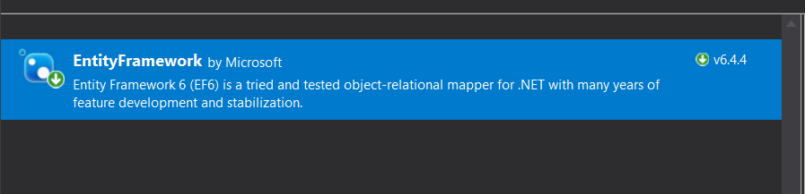
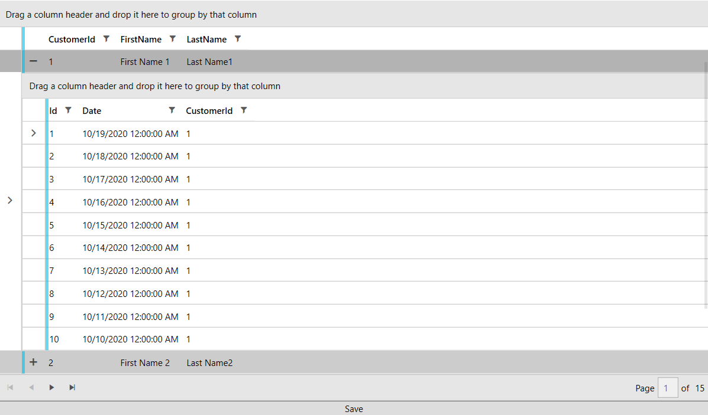

# MVVM Usage

This article shows how to create a database using the code-first approach and display data with the help of RadEntityFrameworkDataSource and RadGridView.

>important Before proceeding with this tutorial, you should follow the "Entity Framework" MSDN articles including the [Code First to a New Database](https://docs.microsoft.com/en-us/ef/ef6/modeling/code-first/workflows/new-database) one. 

## Creating the Application and Adding References

In order to get started, you can create a new project and add the __EntityFramework__ NuGet.

#### __Figure 1: EntityFramework NuGet__


Then you can add the needed Telerik references.

* __Telerik.Windows.Controls__
* __Telerik.Windows.Controls.Data__
* __Telerik.Windows.Controls.EntityFramework60__
* __Telerik.Windows.Controls.GridView__
* __Telerik.Windows.Controls.Input__
* __Telerik.Windows.Data__

## Adding the Models and DbContext

We will create two classes, which will serve as our models: Customer and Order, where each customer will have a collection of orders. We will also define a DbContext that will hold the entities.  

__Example 1: Defining the Models, DbContext and ViewModel__
```C#

	public class Customer
    {
        [Key]
        [DatabaseGenerated(DatabaseGeneratedOption.Identity)]
        public int CustomerId { get; set; }
        public string FirstName { get; set; }
        public string LastName { get; set; }
        public virtual List<Order> Orders { get; set; }
    }

    public class Order
    {
        [Key]
        [DatabaseGenerated(DatabaseGeneratedOption.Identity)]
        public int Id { get; set; }
        public DateTime Date { get; set; }

        public int CustomerId { get; set; }

        [ForeignKey("CustomerId")]
        public virtual Customer Customer { get; set; }
    }

    public class MyContext : DbContext
    {
        public MyContext(string connString) : base(connString)
        {
        }

        public DbSet<Customer> Customers { get; set; }
        public DbSet<Order> Orders { get; set; }
    }
    
```

## Populating the Database

We will create a viewmodel that will populate our database and also hold an instance of a __QueryableEntityCollectionView__ that will be the bridge between the RadGridView and our database. We will also introduce a command that will execute the __SaveChanges__ method of the DbContext on a button's click. 

__Example 2: Defining the ViewModel__
```C#

	public class ViewModel : ViewModelBase
    {
        private QueryableEntityCollectionView<Customer> entityCollectionView;

        private MyContext context;

        public ViewModel()
        {
            // You might need to update the connection string to suit the setup on your machine 
            this.context = new MyContext(@"Data Source=.\SQLEXPRESS;Initial Catalog=CustomerDB;Integrated security=true");
            this.SaveCommand = new DelegateCommand(Save);

            this.AddData(context);
            this.EntityCollectionView = new QueryableEntityCollectionView<Customer>(((IObjectContextAdapter)context).ObjectContext, "Customers", new Collection<string>() { "Orders" });
        }

        public DelegateCommand SaveCommand { get; }

        public QueryableEntityCollectionView<Customer> EntityCollectionView
        {
            get { return entityCollectionView; }
            set
            {
                this.entityCollectionView = value;
                this.OnPropertyChanged(() => this.EntityCollectionView);
            }
        }

        private void AddData(MyContext context)
        {
            for (int i = 1; i <= 25; i++)
            {
                var customer = new Customer() { FirstName = "First Name " + i, LastName = "Last Name" + i };

                for (int j = 1; j <= 10; j++)
                {
                    var order = new Order() { CustomerId = i, Customer = customer, Date = DateTime.Today.AddDays(-j) };
                    context.Orders.Add(order);
                }
                context.Customers.Add(customer);
            }

            context.SaveChanges();
        }

        public void Save(object obj)
        {
            this.context.SaveChanges();
        }
    }
```

## Displaying the Data

All that is left is to declare our XAML and wire up the viewmodel. We will display the data in a RadGridView with a [Row Details Template]() and use a [RadDataPager]() to add paging functionality. 

__Example 3: Seting up the XAML__
```XAML

	 <Grid>
        <Grid.DataContext>
            <local:ViewModel />
        </Grid.DataContext>
        <Grid.RowDefinitions>
            <RowDefinition />
            <RowDefinition Height="Auto"/>
            <RowDefinition Height="Auto"/>
        </Grid.RowDefinitions>
        <telerik:RadGridView GroupRenderMode="Flat" ItemsSource="{Binding PagedSource, ElementName=pager}" AutoGenerateColumns="False">
            <telerik:RadGridView.Columns>
                <telerik:GridViewToggleRowDetailsColumn />
                <telerik:GridViewDataColumn DataMemberBinding="{Binding CustomerId}" />
                <telerik:GridViewDataColumn DataMemberBinding="{Binding FirstName}" />
                <telerik:GridViewDataColumn DataMemberBinding="{Binding LastName}" />
            </telerik:RadGridView.Columns>
            <telerik:RadGridView.RowDetailsTemplate>
                <DataTemplate>
                    <telerik:RadGridView GroupRenderMode="Flat"  ItemsSource="{Binding Orders}" AutoGenerateColumns="False">
                        <telerik:RadGridView.Columns>
                            <telerik:GridViewDataColumn DataMemberBinding="{Binding Id}" />
                            <telerik:GridViewDataColumn DataMemberBinding="{Binding Date}" />
                            <telerik:GridViewDataColumn DataMemberBinding="{Binding CustomerId}" />
                        </telerik:RadGridView.Columns>
                    </telerik:RadGridView>
                </DataTemplate>
            </telerik:RadGridView.RowDetailsTemplate>
        </telerik:RadGridView>
        <telerik:RadDataPager x:Name="pager" Source="{Binding EntityCollectionView}" PageSize="5"  Grid.Row="1" />
        <Button Content="Save" Grid.Row="2">
            <telerik:EventToCommandBehavior.EventBindings>
                <telerik:EventBinding EventName="Click" Command="{Binding SaveCommand}" />
            </telerik:EventToCommandBehavior.EventBindings>
        </Button>
    </Grid>
```

#### __Figure 2: Result from running the example in the Fluent theme__


## See also

* [Getting Started]()
* [RadGridView]()
