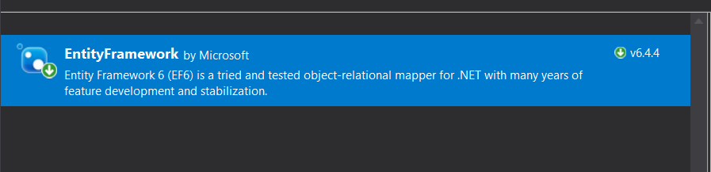
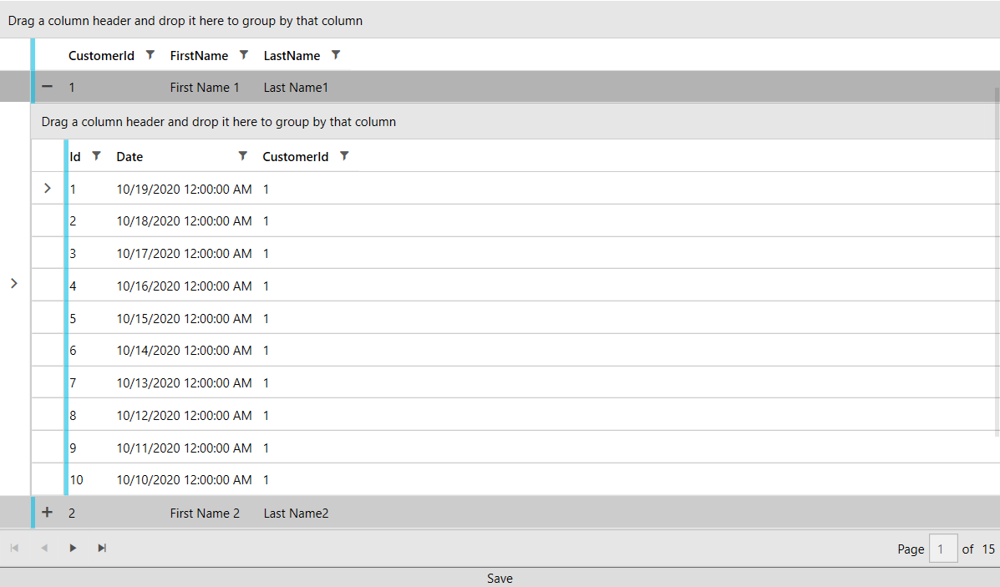

# MVVM Usage

This article shows how to create a database using the code-first approach and display data with the help of RadEntityFrameworkDataSource and RadGridView.

>important Before proceeding with this tutorial, you should follow the "Entity Framework" MSDN articles including the [Code First to a New Database](https://docs.microsoft.com/en-us/ef/ef6/modeling/code-first/workflows/new-database) one. 

## Creating the Application and Adding References

In order to get started, you can create a new project and add the __EntityFramework__ NuGet.

#### __Figure 1: EntityFramework NuGet__

Then you can add the needed Telerik references.

* __Telerik.Windows.Controls__
* __Telerik.Windows.Controls.Data__
* __Telerik.Windows.Controls.EntityFramework60__
* __Telerik.Windows.Controls.GridView__
* __Telerik.Windows.Controls.Input__
* __Telerik.Windows.Data__

## Adding the Models and DbContext

We will create two classes, which will serve as our models: Customer and Order, where each customer will have a collection of orders. We will also define a DbContext that will hold the entities.  

__Example 1: Defining the Models, DbContext and ViewModel__
<snippet id='radentityframeworkdatasource-entityframework-mvvm-example_1_defining_the_models_dbcontext_and_viewmodel-cs' />

## Populating the Database

We will create a viewmodel that will populate our database and also hold an instance of a __QueryableEntityCollectionView__ that will be the bridge between the RadGridView and our database. We will also introduce a command that will execute the __SaveChanges__ method of the DbContext on a button's click. 

__Example 2: Defining the ViewModel__
<snippet id='radentityframeworkdatasource-entityframework-mvvm-example_2_defining_the_viewmodel-cs' />

## Displaying the Data

All that is left is to declare our XAML and wire up the viewmodel. We will display the data in a RadGridView with a [Row Details Template]() and use a [RadDataPager]() to add paging functionality. 

__Example 3: Seting up the XAML__
<snippet id='radentityframeworkdatasource-entityframework-mvvm-example_3_seting_up_the_xaml-xaml' />

#### __Figure 2: Result from running the example in the Fluent theme__

## See also

* [Getting Started]()
* [RadGridView]()
