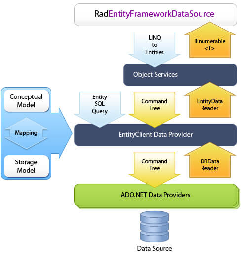

# Overview

__RadEntityFrameworkDataSource__ is a WPF data control that provides seamless integration between an user interface and data coming from an  
        [Entity Framework](http://msdn.microsoft.com/en-us/library/bb399572.aspx)  Container.  __RadEntityFrameworkDataSource__ generates 
        [LINQ to Entities](http://msdn.microsoft.com/en-us/library/bb399367.aspx) queries to retrieve data from an 
        [ObjectContext](http://msdn.microsoft.com/en-us/library/system.data.objects.objectcontext.aspx)
         based on an 
         [
             ObjectQuery<T>
           ](http://msdn.microsoft.com/en-us/library/bb345303.aspx). The control can also perform basic CRUD operations on entities located in the container. You can retrieve, shape and edit data using declarative XAML syntax only. __RadEntityFrameworkDataSource__ provides extensive code-behind API for more advanced scenarios.  __The QueryableEntityCollectionView<T>__ class, which is internally used by the control, is made publicly available for use in view models part of an MVVM architecture, where the usage of UI elements is not recommended. Thanks to the fact that all controls are part of the Telerik family, __RadEntityFrameworkDataSource__ can codelessly integrate with __RadGridView__, __RadDataPager__ and __RadDataFilter__ and perform paging, filtering, sorting, and grouping directly on the database server. 
           __RadEntityFrameworkDataSource__ can also be used as a standalone data source control since it provides the public API needed for loading, shaping and editing data.
      

## Features 

* __Codeless approach__ integration with RadGridView, RadDataPager and RadDataFilter - Since all of the controls share the same data engine logic, when data-bound together they are able to detect each other automatically and start exchanging information. Linking RadGridView, RadDataPager and RadDataFilter to a RadEntityFrameworkDataSource is as easy as binding them to its DataView property. All operations such as paging, filtering, sorting, and grouping will automatically happen on the server without a single line of code.
            

* __Filtering__ - it can easily be performed through the FilterDescriptors collection of the control. This can either be done manually by the developer through editing the collection in code-behind or it can be left to controls such as RadGridView or RadDataFilter which will automatically translate their filtering criteria and apply it to RadEntityFrameworkDataSource without a single line of code.
            

* __Sorting__ - it can easily be performed through the SortDescriptors collection of the control. This can either be done manually by the developer through editing the collection in code-behind or it can be left to RadGridView which will automatically translate its sorting criteria and apply it to RadEntityFrameworkDataSource without a single line of code.
          

* __Grouping__ - it can easily be performed through the GroupDescriptors collection of the control. This can either be done manually by the developer through editing the collection in code-behind or it can be left to RadGridView which will automatically translate its grouping criteria and apply it to RadEntityFrameworkDataSource without a single line of code.
         

* __Paging__ - it can easily be performed through the paging API that the DataView of control provides. It can be done manually by the developer through methods from the MoveTo*Page family and properties such as PageIndex and PageSize. Or it can be left entirely to RadDataPager which will automatically page on the server when bound to the DataView of the control.
          

* __Editing__ - it is as simple as adding, removing or editing entities in the DataView of the control and then calling the SubmitChanges methods These operations can also be left to RadGridView which will automatically transfer them to the RadEntityFrameworkDataSource.
          

* __MVVM support__ - is provided by the public QueryableEntityCollectionView<T> class, which is the view that RadEntityFrameworkDataSource internally uses. The RadEntityFrameworkDataSource control is simply a thin-wrapper over this collection view, which performs all of the heavy lifting. This allows you to use it inside your view models without losing any functionality that the control would otherwise provide.
          
