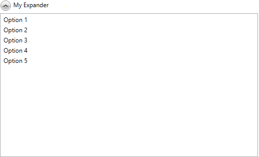

# Getting Started with {{ site.framework_name }} Expander

This article will provide you with the knowledge required to use the **RadExpander** control in a basic scenario.

## Adding Telerik Assemblies Using NuGet

To use `RadExpander` when working with NuGet packages, install the `Telerik.Windows.Controls.for.Wpf.Xaml` package. The [package name may vary]() slightly based on the Telerik dlls set - [Xaml or NoXaml]()

Read more about NuGet installation in the [Installing UI for WPF from NuGet Package]() article.

>tip With the 2025 Q1 release, the Telerik UI for WPF has a new licensing mechanism. You can learn more about it [here]().

## Adding Assembly References Manually

If you are not using NuGet packages, you can add a reference to the following assemblies:

* __Telerik.Licensing.Runtime__
* __Telerik.Windows.Controls__

You can find the required assemblies for each control from the suite in the [Controls Dependencies]()[Controls Dependencies]() help article.

## Add а RadExpander to the Project

The __RadExpander__ is a __HeaderedContentControl__ and you can initialize both its __Header__ and __Content__ properties.

__Example 1: RadExpander definition__
```XAML
	<telerik:RadExpander Header="My Expander">
	    <ListBox>
	        <ListBoxItem Content="Option 1" />
	        <ListBoxItem Content="Option 2" />
	        <ListBoxItem Content="Option 3" />
	        <ListBoxItem Content="Option 4" />
	        <ListBoxItem Content="Option 5" />
	    </ListBox>
	</telerik:RadExpander>
```

#### Figure 1: The RadExpander generated by the code in Example 1



## Declaring more complex Header and Content

As both __Header__ and __Content__ properties are of type **object** there's no limits as to what you can display inside the control. **Example 2** demonstrates a more complex layout with some hard-coded values. You can, of course, introduce an items control and define its **ItemContainerStyle** and **ItemTemplate**, for example.

__Example 2: More complex content__

```XAML
    <telerik:RadExpander x:Name="radExpander"
                         VerticalContentAlignment="Top"
                         IsExpanded="True">
        <telerik:RadExpander.Header>
            <TextBlock Text="Header" />
        </telerik:RadExpander.Header>
        <telerik:RadExpander.Content>
            <Grid>
                <Grid.ColumnDefinitions>
                    <ColumnDefinition />
                    <ColumnDefinition />
                </Grid.ColumnDefinitions>
                <Grid.RowDefinitions>
                    <RowDefinition Height="Auto" />
                    <RowDefinition Height="Auto" />
                </Grid.RowDefinitions>
                <Border Height="131"
                        Margin="5"
                        BorderBrush="#FFDADADA"
                        BorderThickness="0,0,1,1"
                        CornerRadius="3">
                    <Border BorderBrush="#B2ADBDD1"
                            BorderThickness="1"
                            CornerRadius="2">
                        <StackPanel Orientation="Horizontal">
                            <Border Width="108"
                                    Height="108"
                                    Margin="10 0 0 0"
                                    BorderBrush="#FFE0E0E0"
                                    BorderThickness="1">
                                <Image Source="/Images/item1.png" Stretch="None" />
                            </Border>
                            <StackPanel Margin="10 25 10 0">
                                <TextBlock Margin="0 0 0 5"
                                           FontFamily="Segoe UI"
                                           FontSize="16"
                                           Foreground="#FF0099CC"
                                           Text="Bob Smiil" />
                                <TextBlock Margin="0 0 0 5"
                                           FontFamily="Segoe UI"
                                           FontSize="11"
                                           Text="BobSmiil@mail.com" />
                                <TextBlock FontFamily="Segoe UI"
                                           FontSize="10.667"
                                           Text="Phone: 333 2334" />
                            </StackPanel>
                        </StackPanel>
                    </Border>
                </Border>
                <Border Grid.Row="1"
                        Height="131"
                        Margin="5"
                        BorderBrush="#FFDADADA"
                        BorderThickness="0,0,1,1"
                        CornerRadius="3">
                    <Border BorderBrush="#B2ADBDD1"
                            BorderThickness="1"
                            CornerRadius="2">
                        <StackPanel Orientation="Horizontal">
                            <Border Width="108"
                                    Height="108"
                                    Margin="10 0 0 0"
                                    BorderBrush="#FFE0E0E0"
                                    BorderThickness="1">
                                <Image Source="/Images/item2.png" Stretch="None" />
                            </Border>
                            <StackPanel Margin="10 25 15 0">
                                <TextBlock Margin="0 0 0 5"
                                           FontFamily="Segoe UI"
                                           FontSize="16"
                                           Foreground="#FF0099CC"
                                           Text="Anne Dodsworth" />
                                <TextBlock Margin="0 0 0 5"
                                           FontFamily="Segoe UI"
                                           FontSize="11"
                                           Text="Anne Dodsworth@mail.com" />
                                <TextBlock FontFamily="Segoe UI"
                                           FontSize="10.667"
                                           Text="Phone: 333 2334" />
                            </StackPanel>
                        </StackPanel>
                    </Border>
                </Border>
                <Border Grid.Column="1"
                        Height="131"
                        Margin="5"
                        BorderBrush="#FFDADADA"
                        BorderThickness="0,0,1,1"
                        CornerRadius="3">
                    <Border BorderBrush="#B2ADBDD1"
                            BorderThickness="1"
                            CornerRadius="2">
                        <StackPanel Orientation="Horizontal">
                            <Border Width="108"
                                    Height="108"
                                    Margin="10 0 0 0"
                                    BorderBrush="#FFE0E0E0"
                                    BorderThickness="1">
                                <Image Source="/Images/item3.png" Stretch="None" />
                            </Border>
                            <StackPanel Margin="10 25 10 0">
                                <TextBlock Margin="0 0 0 5"
                                           FontFamily="Segoe UI"
                                           FontSize="16"
                                           Foreground="#FF0099CC"
                                           Text="Andrew Fuller" />
                                <TextBlock Margin="0 0 0 5"
                                           FontFamily="Segoe UI"
                                           FontSize="11"
                                           Text="AndrewFuller@mail.com" />
                                <TextBlock FontFamily="Segoe UI"
                                           FontSize="10.667"
                                           Text="Phone: 333 2334" />
                            </StackPanel>
                        </StackPanel>
                    </Border>
                </Border>
                <Border Grid.Row="1"
                        Grid.Column="1"
                        Height="131"
                        Margin="5"
                        BorderBrush="#FFDADADA"
                        BorderThickness="0,0,1,1"
                        CornerRadius="3">
                    <Border BorderBrush="#B2ADBDD1"
                            BorderThickness="1"
                            CornerRadius="2">
                        <StackPanel Orientation="Horizontal">
                            <Border Width="108"
                                    Height="108"
                                    Margin="10 0 0 0"
                                    BorderBrush="#FFE0E0E0"
                                    BorderThickness="1">
                                <Image Source="/Images/item4.png" Stretch="None" />
                            </Border>
                            <StackPanel Margin="10 25 15 0">
                                <TextBlock Margin="0 0 0 5"
                                           FontFamily="Segoe UI"
                                           FontSize="16"
                                           Foreground="#FF0099CC"
                                           Text="Emily Smile" />
                                <TextBlock Margin="0 0 0 5"
                                           FontFamily="Segoe UI"
                                           FontSize="11"
                                           Text="EmilySmile@mail.com" />
                                <TextBlock FontFamily="Segoe UI"
                                           FontSize="10.667"
                                           Text="Phone: 333 2334" />
                            </StackPanel>
                        </StackPanel>
                    </Border>
                </Border>
            </Grid>
        </telerik:RadExpander.Content>
    </telerik:RadExpander>
```

#### Figure 2: The RadExpander generated by the code in Example 2


## Setting a Theme

The controls from our suite support different themes. You can see how to apply a theme different than the default one in the [Setting a Theme]() help article.

>important Changing the theme using implicit styles will affect all controls that have styles defined in the merged resource dictionaries. This is applicable only for the controls in the scope in which the resources are merged. 

To change the theme, you can follow the steps below:

* Choose between the themes and add reference to the corresponding theme assembly (ex: **Telerik.Windows.Themes.Windows8.dll**). You can see the different themes applied in the **Theming** examples from our [WPF Controls Examples](https://demos.telerik.com/wpf/)[Silverlight Controls Examples](https://demos.telerik.com/silverlight/#Diagrams/Theming) application.

* Merge the ResourceDictionaries with the namespace required for the controls that you are using from the theme assembly. For the __RadExpander__, you will need to merge the following resources:

	* __Telerik.Windows.Controls__

__Example 12__ demonstrates how to merge the ResourceDictionaries so that they are applied globally for the entire application.

__Example 12: Merge the ResourceDictionaries__  
```XAML
	<Application.Resources>
		<ResourceDictionary>
			<ResourceDictionary.MergedDictionaries>
				<ResourceDictionary Source="/Telerik.Windows.Themes.Windows8;component/Themes/System.Windows.xaml"/>
				<ResourceDictionary Source="/Telerik.Windows.Themes.Windows8;component/Themes/Telerik.Windows.Controls.xaml"/>
			</ResourceDictionary.MergedDictionaries>
		</ResourceDictionary>
	</Application.Resources>
```

>Alternatively, you can use the theme of the control via the [StyleManager](https://docs.telerik.com/devtools/wpf/styling-and-appearance/stylemanager/common-styling-apperance-setting-theme-wpf)[StyleManager](https://docs.telerik.com/devtools/silverlight/styling-and-appearance/stylemanager/common-styling-apperance-setting-theme).

__Figure 3__ shows a __RadExpander__ with the **Windows8** theme applied.

#### __Figure 3: RadExpander with the Windows8 theme__



## Telerik UI for WPF Learning Resources

* [Telerik UI for WPF Expander Component](https://www.telerik.com/products/wpf/expander.aspx)
* [Getting Started with Telerik UI for WPF Components]()
* [Telerik UI for WPF Installation]()
* [Telerik UI for WPF and WinForms Integration]()
* [Telerik UI for WPF Visual Studio Templates]()
* [Setting a Theme with Telerik UI for WPF]()
* [Telerik UI for WPF Virtual Classroom (Training Courses for Registered Users)](https://learn.telerik.com/learn/course/external/view/elearning/16/telerik-ui-for-wpf) 
* [Telerik UI for WPF License Agreement](https://www.telerik.com/purchase/license-agreement/wpf-dlw-s)


## See Also
 * [Expand Direction]()
 * [Alignment]()
 * [Expander Animation]()
 * [How To Change the Action Trigering an Expand]()
