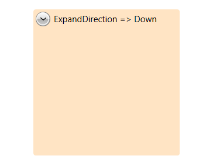
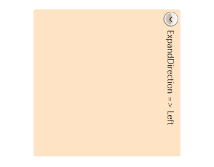
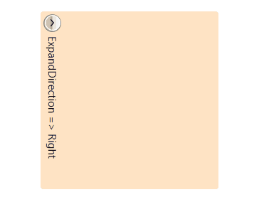
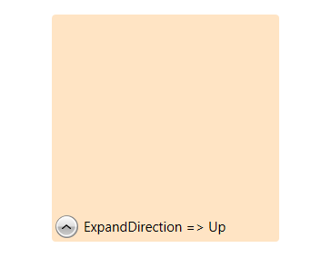

# Expand Direction

The __ExpandDirection__ property gets or sets the direction in which the content would expand. This property is an enumeration which expose four values: __Down, Left, Right, Up__.

#### __[XAML] Example 1: Setting ExpandDirection property__
{{region radexpander-features-expand_direction_0}}
   <Grid>
		<telerik:RadExpander Width="200" Height="200"
							ExpandDirection="Down" Background="Bisque"
							Header="ExpandDirection Down">
			<StackPanel Orientation="Vertical">
				<Ellipse Width="99"  
						Height="99" 
						Margin="5" 
						Fill="Blue" />
			</StackPanel>
		</telerik:RadExpander>
	</Grid>
{{endregion}}

#### __Figure 1: ExpandDirection set to Down__

#### __Figure 2: ExpandDirection set to Left__

#### __Figure 3: ExpandDirection set to Right__

#### __Figure 4: ExpandDirection set to Up__

